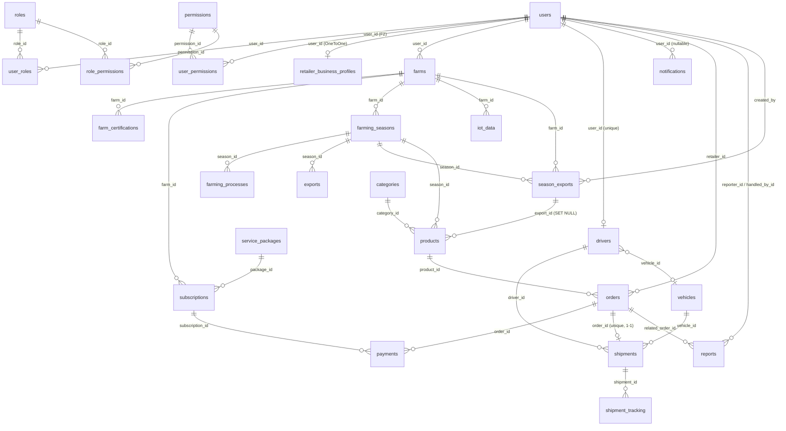

# TÀI LIỆU ĐẶC TẢ CHI TIẾT HỆ THỐNG BICAP

## DỰ ÁN: TÍCH HỢP BLOCKCHAIN TRONG SẢN XUẤT NÔNG SẢN SẠCH (BICAP)

| Thông tin | Chi tiết |
|---|---|
| **Tên dự án (EN)** | Blockchain Integration in Clean Agricultural Production |
| **Tên dự án (VN)** | Tích hợp Blockchain trong sản xuất nông sản sạch |
| **Viết tắt** | BICAP |
| **Loại tài liệu** | Đặc tả hệ thống theo mã nguồn hiện hành (As-Built System Specification) |
| **Phiên bản tài liệu** | 1.0 |
| **Ngày tạo** | 15/09/2026 |
| **Trạng thái** | Hoàn thiện |
| **Cơ sở soạn thảo** | Đọc và phân tích trực tiếp toàn bộ mã nguồn trong repository (`backend/`, `web/`, `dev/`, `docs/`, cấu hình CI/CD) |

> **Lưu ý về tính chất tài liệu:** Đây là tài liệu **đặc tả hệ thống như đã được cài đặt** (as-built), mô tả chính xác hành vi, cấu trúc, API, mô hình dữ liệu và cấu hình của mã nguồn hiện tại — không phải tài liệu yêu cầu (xem `docs/software-requirement-specifications.md`) hay tài liệu thiết kế dự kiến (xem `docs/architecture-design.md`, `docs/detail-design.md`). Mọi nội dung trong tài liệu này đều được đối chiếu với mã nguồn tại thời điểm 15/09/2026.

---

## Mục lục

1. [Giới thiệu](#1-giới-thiệu)
2. [Tổng quan hệ thống](#2-tổng-quan-hệ-thống)
3. [Kiến trúc hệ thống](#3-kiến-trúc-hệ-thống)
4. [Mô hình dữ liệu](#4-mô-hình-dữ-liệu)
5. [Bảo mật, xác thực và phân quyền](#5-bảo-mật-xác-thực-và-phân-quyền)
6. [Đặc tả API chi tiết](#6-đặc-tả-api-chi-tiết)
7. [Đặc tả nghiệp vụ chi tiết](#7-đặc-tả-nghiệp-vụ-chi-tiết)
8. [Tích hợp Blockchain VeChainThor](#8-tích-hợp-blockchain-vechainthor)
9. [Đặc tả ứng dụng Web](#9-đặc-tả-ứng-dụng-web)
10. [Cấu hình và triển khai](#10-cấu-hình-và-triển-khai)
11. [Kiểm thử hệ thống](#11-kiểm-thử-hệ-thống)
12. [Công cụ phát triển và Smart Contracts](#12-công-cụ-phát-triển-và-smart-contracts)
13. [Ràng buộc và quy ước](#13-ràng-buộc-và-quy-ước)
14. [Phụ lục](#14-phụ-lục)

---

## 1. Giới thiệu

### 1.1. Mục đích tài liệu

Tài liệu này đặc tả chi tiết hệ thống **BICAP — nền tảng tích hợp Blockchain trong sản xuất nông sản sạch** dựa trên phân tích toàn bộ mã nguồn hiện có trong repository. Mục đích:

- Cung cấp một bức tranh **chính xác, đầy đủ và duy nhất** về hệ thống đã được cài đặt: kiến trúc, mô hình dữ liệu, giao diện API, cơ chế bảo mật, luồng nghiệp vụ, tích hợp blockchain, cấu hình và quy trình kiểm thử/triển khai.
- Làm tài liệu gốc để đội phát triển bảo trì, mở rộng hệ thống mà không phải truy ngược mã nguồn.
- Làm cơ sở đối chiếu giữa **yêu cầu nghiệp vụ** (`docs/software-requirement-specifications.md`, `docs/user-requirements.md`) và **hiện trạng triển khai**.

### 1.2. Phạm vi tài liệu

Tài liệu bao phủ toàn bộ các thành phần hiện diện trong repository:

| Thành phần | Nội dung đặc tả |
|---|---|
| `backend/` | Ứng dụng Spring Boot 3.3 (Java 21): 247 file Java chính (entity, repository, service, controller, DTO, cấu hình, bảo mật, blockchain) + 45 file test |
| `web/` | Ứng dụng web hợp nhất React 19 + TypeScript + Vite: 90 file `.ts/.tsx` (portal + admin dashboard) + test |
| `dev/` | Smart contract Solidity, công cụ sinh ví/khóa blockchain, loadtest k6/Node, kịch bản kiểm thử chéo vai trò, script chạy backend |
| `docs/sql/` | 7 script migration SQL áp dụng cho MySQL production (`DDL_AUTO=validate`) |
| `.github/workflows/` | CI pipeline (lint/test/build web; test/package backend) |

**Ngoài phạm vi:** UI mobile cho tài xế đã được gỡ khỏi repository (chỉ còn backend API `/api/driver/**`); Docker không còn được sử dụng.

### 1.3. Phương pháp xây dựng

1. Thống kê và liệt kê toàn bộ cây thư mục, tệp mã nguồn của repository.
2. Đọc từng nhóm thành phần: entity/repository, service, controller/DTO, cấu hình & bảo mật, tích hợp blockchain, frontend, script dev, tài liệu SQL, CI.
3. Tổng hợp thành đặc tả theo từng chương, đối chiếu chéo giữa các tầng (controller ↔ service ↔ entity ↔ SQL migration).

### 1.4. Đối tượng đọc

| Đối tượng | Mục đích sử dụng |
|---|---|
| **Developers** | Nắm cấu trúc, API, quy ước để phát triển/bảo trì |
| **Testers** | Xây dựng test case từ đặc tả API và luồng nghiệp vụ |
| **DevOps / Vận hành** | Cấu hình môi trường, triển khai, giám sát |
| **Quản lý dự án / Giảng viên** | Đánh giá hiện trạng hệ thống so với yêu cầu |

### 1.5. Thuật ngữ và từ viết tắt

| Thuật ngữ | Giải nghĩa |
|---|---|
| **BICAP** | Blockchain Integration in Clean Agricultural Production |
| **RBAC** | Role-Based Access Control — phân quyền theo vai trò |
| **JWT** | JSON Web Token — token xác thực không trạng thái |
| **SSE** | Server-Sent Events — kênh đẩy thông báo realtime một chiều |
| **IoT** | Internet of Things — cảm biến môi trường (nhiệt độ/độ ẩm/pH) |
| **VTHO** | Đơn vị gas của VeChainThor |
| **RLP** | Recursive Length Prefix — mã hóa giao dịch Ethereum/VeChain |
| **secp256k1** | Đường cong elliptic dùng ký giao dịch blockchain |
| **Farming Season (Mùa vụ)** | Một chu kỳ sản xuất từ gieo trồng đến thu hoạch |
| **Farming Process (Nhật ký canh tác)** | Các bước canh tác trong một mùa vụ |
| **Export (Xuất kho)** | Lô nông sản xuất kho, được neo lên blockchain và gắn mã QR |
| **Trading Floor (Sàn giao dịch)** | Nơi nông trại đăng bán và nhà bán lẻ đặt mua |
| **Shipment (Lô vận chuyển)** | Đơn vị giao hàng từ nông trại đến nhà bán lẻ |
| **Deposit (Đặt cọc)** | Khoản cọc nhà bán lẻ thanh toán khi đặt hàng (mặc định 30%) |
| **Sepay** | Cổng thanh toán qua chuyển khoản ngân hàng + webhook |

---

## 2. Tổng quan hệ thống

### 2.1. Mục tiêu hệ thống

BICAP là nền tảng quản lý **chuỗi cung ứng nông sản sạch** kết nối bốn nhóm tác nhân — **Nông trại, Nhà bán lẻ, Đơn vị vận chuyển và Người tiêu dùng** — trong đó dữ liệu canh tác, thu hoạch, xuất kho và truy xuất nguồn gốc được neo lên blockchain công khai **VeChainThor** để đảm bảo tính **minh bạch, bất biến và truy xuất được**.

Các giá trị cốt lõi:

1. **Truy xuất nguồn gốc minh bạch** — mỗi lô xuất kho được neo on-chain kèm mã QR; người tiêu dùng quét QR xem được nông trại, mùa vụ, nhật ký canh tác của đúng lô hàng.
2. **Sàn giao dịch nông sản** — nông trại đăng bán theo lô, nhà bán lẻ đặt mua, đặt cọc và thanh toán qua ngân hàng (Sepay).
3. **Quản lý vận chuyển** — lô hàng, tài xế, phương tiện và hành trình được theo dõi realtime.
4. **Giám sát IoT** — dữ liệu cảm biến nhiệt độ/độ ẩm/pH của mùa vụ.
5. **Quản trị tập trung** — phê duyệt nông trại, quản lý tài khoản admin theo RBAC, giám sát sản phẩm, smart contract và báo cáo người dùng.

### 2.2. Các tác nhân (Actors)

| Vai trò (Role) | Khu vực truy cập | Mô tả |
|---|---|---|
| `SUPER_ADMIN` | `/admin` | Toàn quyền: quản lý tài khoản admin (CRUD), phê duyệt nông trại, quản lý hệ thống |
| `ADMIN` | `/admin` | Tạo/đọc/sửa tài khoản admin, phê duyệt nông trại, quản lý vận hành |
| `MODERATOR` | `/admin` | Chỉ đọc (giám sát) |
| `FARM_MANAGER` | `/` (portal) | Quản lý nông trại, mùa vụ, nhật ký canh tác, IoT, xuất kho & QR, đăng bán trên sàn, theo dõi đơn hàng |
| `RETAILER` | `/` (portal) | Đặt mua trên sàn, đặt cọc, thanh toán, theo dõi đơn hàng và vận chuyển |
| `SHIPPING_MGR` | `/` (portal) | Quản lý lô vận chuyển, tài xế, phương tiện, báo cáo sự cố |
| `SHIP_DRIVER` | API `/api/driver/**` | Thực thi giao hàng, cập nhật hành trình (UI mobile đã gỡ, còn API) |
| `GUEST` | `/` (portal, không đăng nhập) | Xem sản phẩm đang bán, nội dung giáo dục, thông báo hệ thống, quét QR truy xuất |

### 2.3. Các sản phẩm phần mềm hiện hành

So với đặc tả gốc gồm 7 sản phẩm (SRS v1.0), repository hiện tại triển khai:

| # | Sản phẩm | Hình thức triển khai hiện tại |
|---|---|---|
| 1 | Admin Web App | Khu vực `/admin/*` trong app web hợp nhất `web/` |
| 2 | Farm Management Web App | Khu vực portal `/` (role `FARM_MANAGER`) |
| 3 | Retailer Web App | Khu vực portal `/` (role `RETAILER`) |
| 4 | Shipping Management Web App | Khu vực portal `/` (role `SHIPPING_MGR`) |
| 5 | Shipping Driver Mobile App | **UI đã gỡ**; backend giữ `DriverMobileController` + API `/api/driver/**` |
| 6 | Guest App | Khu vực portal `/` không đăng nhập + trang truy xuất công khai `/trace/{hash}` |
| 7 | Backend Web API | `backend/` Spring Boot, phục vụ `/api/**` và static shell của web app |

Toàn bộ giao diện nằm trong **một bundle web duy nhất**, Spring Boot phục vụ cả API và static assets trên **một port** (mặc định `8080`).

### 2.4. Phạm vi chức năng theo vai trò

| Nhóm chức năng | SUPER_ADMIN | ADMIN | MODERATOR | FARM_MANAGER | RETAILER | SHIPPING_MGR | SHIP_DRIVER | GUEST |
|---|:---:|:---:|:---:|:---:|:---:|:---:|:---:|:---:|
| Đăng ký/đăng nhập/refresh token | ✅ | ✅ | ✅ | ✅ | ✅ | ✅ | ✅ | Đăng ký* |
| Quản lý tài khoản admin (CRUD) | ✅ | Tạo/Đọc/Sửa | Đọc | — | — | — | — | — |
| Phê duyệt/quản lý nông trại | ✅ | ✅ | Đọc | — | — | — | — | — |
| Đăng ký nông trại, hồ sơ, chứng nhận | — | — | — | ✅ | — | — | — | — |
| Mùa vụ & nhật ký canh tác | — | — | — | ✅ | — | — | — | — |
| Dữ liệu IoT | — | — | — | ✅ | — | — | — | — |
| Xuất kho & QR truy xuất | — | — | — | ✅ | — | — | — | — |
| Đăng bán sản phẩm lên sàn | — | — | — | ✅ | — | — | — | — |
| Xem sàn / đặt mua / đặt cọc / thanh toán | — | — | — | — | ✅ | — | — | Xem |
| Quản lý lô vận chuyển/tài xế/phương tiện | — | — | — | — | — | ✅ | — | — |
| Thực thi giao hàng (API) | — | — | — | — | — | — | ✅ | — |
| Quản lý sản phẩm & danh mục | ✅ | ✅ | Đọc | — | — | — | — | — |
| Smart contract & giao dịch blockchain | ✅ | ✅ | Đọc | — | — | — | — | — |
| Gói dịch vụ & subscription | ✅ | ✅ | Đọc | Mua | — | — | — | Xem gói |
| Báo cáo người dùng | ✅ | ✅ | Đọc | Gửi | Gửi | Gửi | Gửi | — |
| Thông báo | ✅ | ✅ | ✅ | ✅ | ✅ | ✅ | ✅ | Chỉ thông báo hệ thống |
| Nội dung giáo dục | — | — | — | — | — | — | — | ✅ |
| Truy xuất QR công khai | — | — | — | — | — | — | — | ✅ |

\* Người dùng tự đăng ký qua portal với vai trò mặc định (`FARM_MANAGER` hoặc `RETAILER`); tài khoản admin chỉ do SUPER_ADMIN/ADMIN tạo.

---

## 3. Kiến trúc hệ thống

### 3.1. Sơ đồ kiến trúc tổng quan

```
┌──────────────────────────────────────────────────────────────────────┐
│  web/ — MỘT ứng dụng React 19 + TypeScript + Vite (single bundle)    │
│                                                                      │
│   "/"            → Portal (Farm · Retailer · Shipping · Guest)       │
│   "/admin/*"     → Admin dashboard                                   │
│   "/trace/{hash}"→ Trang truy xuất công khai (public)                │
│                                                                      │
│   Dùng chung: session (localStorage), design system, API layer,      │
│   route guard theo vai trò                                           │
└───────────────────────────────┬──────────────────────────────────────┘
                                │ REST /api/**  (JWT Bearer; SSE cho thông báo)
┌───────────────────────────────▼──────────────────────────────────────┐
│  backend/ — Spring Boot 3.3 · Java 21 · Maven                        │
│                                                                      │
│   Filter chain: RateLimitFilter → JwtAuthenticationFilter → ...      │
│   Controller → Service → Repository (Spring Data JPA)                │
│   Security: JWT + RBAC + Permission · Bcrypt · CSP · CORS            │
│   Cache: Redis (bắt buộc ở production)                               │
│   Scheduler: BlockchainMaintenanceJob (@EnableScheduling)            │
└───────────────┬───────────────────────────┬──────────────────────────┘
                │                           │
        MySQL 8 (remote, JPA)        VeChainThor testnet node
                                     (RLP + secp256k1 ký thủ công,
                                      REST broadcast + polling receipt)
                                     └── Sepay (webhook thanh toán)
```

### 3.2. Chồng công nghệ (Technology Stack)

| Tầng | Công nghệ | Ghi chú |
|---|---|---|
| Backend | Java 21, Spring Boot 3.3.0 | Maven, không có wrapper |
| API | Spring Web MVC (REST), SSE (`SseEmitter`) | |
| Bảo mật | Spring Security 6, JWT (jjwt 0.12.5), BCrypt | STATELESS |
| Dữ liệu | Spring Data JPA/Hibernate, MySQL 8 (production), H2 (test) | |
| Cache | Spring Cache + Redis (`spring-boot-starter-data-redis`) | bắt buộc ở production |
| Blockchain | BouncyCastle 1.78.1 (secp256k1), mã hóa RLP/blake2b/keccak tự viết | không dùng SDK bên thứ ba |
| QR | ZXing core + javase 3.5.3 | sinh QR xuất kho |
| Giám sát | Spring Boot Actuator (`/actuator/health`) | |
| Frontend | React 19.2, TypeScript 6, Vite 8.1 | một bundle cho cả portal + admin |
| Test frontend | Vitest 4, Testing Library, jsdom 30 | |
| Lint frontend | oxlint 1.71 | |
| Load test | k6, Node (undici) | `dev/loadtest/` |
| CI | GitHub Actions | 2 job: `web-ci`, `backend-ci` |
| Smart contract | Solidity 0.8.24 + OpenZeppelin Upgradeable | `dev/blockchain/contracts/` |

### 3.3. Cấu trúc repository

```
bicap-blockchain-agricultural-platform/
├── backend/                                   # Spring Boot API (Maven)
│   ├── pom.xml
│   ├── src/main/java/.../bicap/
│   │   ├── Application.java                   # @SpringBootApplication + @EnableScheduling
│   │   ├── controller/                        # 30 controller REST
│   │   ├── service/                           # ~40 service + scheduler + gateway
│   │   ├── repository/                        # 25 repository JPA
│   │   ├── entity/                            # 40 entity + enum
│   │   ├── dto/                                # ~90 DTO request/response
│   │   ├── config/                            # Security, CORS, Redis, Seeder, Upload, Sepay
│   │   ├── common/blockchain/                 # VeChain client, signer, RLP, hash (tự viết)
│   │   ├── common/security/                   # JWT, filter, authorizer, rate limit
│   │   ├── common/util/                       # ImagesJson, SearchUtils
│   │   └── exception/                         # GlobalExceptionHandler + ErrorResponse
│   ├── src/main/resources/application.properties
│   └── src/test/                              # 45 test (unit + integration, H2 + mock chain)
│
├── web/                                       # Ứng dụng web hợp nhất
│   ├── vite.config.ts  package.json  tsconfig*.json  .oxlintrc.json  .nvmrc
│   ├── index.html  public/
│   └── src/
│       ├── App.tsx                            # Router theo endpoint (/admin vs còn lại)
│       ├── main.tsx  index.css                # Design system dùng chung
│       ├── shared/session.ts                  # Session + API base dùng chung
│       ├── portal/                            # PortalApp + pages (Auth/Farm/Retailer/Shipping/Driver/Guest)
│       ├── admin/                             # AdminApp + components + types
│       └── test/                              # setup vitest + test suites
│
├── dev/                                       # Công cụ phát triển (ngoài build)
│   ├── blockchain/contracts/Traceability.sol  # 4 contract UUPS upgradeable
│   ├── loadtest/                              # k6 + Node load test
│   ├── tests/                                 # cross-role matrix test
│   ├── tools/                                 # WalletGen, AddrFromKey, MnemonicToKey, TxProbe
│   └── run-backend.ps1                        # Nạp .env rồi chạy mvn spring-boot:run
│
├── docs/                                      # Tài liệu (SRS, ADD, detail design, SQL, hướng dẫn...)
│   └── sql/                                   # 7 migration SQL cho MySQL production
├── .github/workflows/ci.yml                   # CI: web (lint/test/build) + backend (test/package)
├── .env.example                               # Template biến môi trường (production-style)
└── readme.md
```

### 3.4. Kiến trúc backend

Backend tổ chức theo kiến trúc **phân lớp (layered architecture)** truyền thống của Spring:

```
HTTP Request
   │
   ▼
[RateLimitFilter]          — chỉ chặn /api/auth/** (30 req/phút/IP)
   │
   ▼
[JwtAuthenticationFilter]  — xác thực Bearer token; kiểm tra X-Actor-Email khớp
   │
   ▼
[DispatcherServlet → Controller]  — @RestController, validation DTO
   │
   ▼
[Service]                  — logic nghiệp vụ, @Transactional
   │
   ▼
[Repository]               — Spring Data JPA
   │
   ▼
MySQL / H2                  Redis (cache)         VeChainThor node / Sepay webhook
```

Các đặc điểm quan trọng:

- **Stateless**: không dùng HTTP session; danh tính đến từ JWT trong header `Authorization: Bearer …`.
- **Scheduling**: `@EnableScheduling` cho phép `BlockchainMaintenanceJob` xác nhận giao dịch on-chain định kỳ.
- **Cache**: 2 cache dùng chung là `bicapCategories` và `bicapMarketplaceDetail` (xem chương 5.9).
- **Upload file**: lưu vào thư mục `app.upload.dir` (mặc định `uploads/`), phục vụ qua `/uploads/**`.
- **Static shell**: sau khi build `web/`, bundle được copy vào `backend/src/main/resources/static/` (bị `.gitignore`) để Spring Boot phục vụ single-port.

### 3.5. Kiến trúc frontend

- **Một ứng dụng, một bundle**: `web/src/App.tsx` chọn `AdminApp` khi path khớp `/^\/admin(?:\/|$)/`, ngược lại chọn `PortalApp` (bao gồm trang trace công khai).
- **Session dùng chung**: `web/src/shared/session.ts` là nguồn duy nhất cho localStorage keys `accessToken`, `refreshToken`, `currentUser` — cả portal và admin dùng chung một lần đăng nhập.
- **API base**: `VITE_API_BASE_URL` (mặc định `http://localhost:8080`) được chuẩn hóa về origin rồi ghép thành `${origin}/api`.
- Chi tiết trang/route/component: xem chương 9.

### 3.6. Các chế độ vận hành (runtime modes)

| Chế độ | Cờ cấu hình | Database | Blockchain | Cache | Mục đích |
|---|---|---|---|---|---|
| **Production** (mặc định) | `ALLOW_SIMULATION=false` | MySQL remote (bắt buộc) | `live` — ký & broadcast thật | Redis (bắt buộc) | Triển khai thật |
| **Test/CI** | `ALLOW_SIMULATION=true` | H2 in-memory | `mock` — hash giả lập tại chỗ | `APP_CACHE_ENABLED=false` (in-memory) | `mvn test`, CI |

Backend **từ chối khởi động** (fail-fast, trước khi tạo bất kỳ bean nào) nếu cấu hình production không hợp lệ — chi tiết tại chương 5.10.

---

## 4. Mô hình dữ liệu

### 4.1. Tổng quan

- **26 entity JPA**, **8 enum**, **26 repository** (`JpaRepository`), `@Id` đều dùng `GenerationType.IDENTITY`.
- Đặc điểm nổi bật: **quan hệ giữa các bảng được mô hình chủ yếu bằng cột khóa ngoài kiểu `Long`** (ví dụ `orders.retailer_id`, `farms.user_id`) thay vì annotation quan hệ JPA. Chỉ có 3 quan hệ `@ManyToMany` (User–Role, User–Permission, Role–Permission, tất cả `EAGER` + `@Fetch(SUBSELECT)`) và 1 quan hệ `@OneToOne` (RetailerBusinessProfile→User). Không có `@OneToMany`/`@ManyToOne`/cascade ở tầng entity; cascade xóa chỉ tồn tại ở cấp DDL SQL (`ON DELETE ...`).
- Audit thủ công bằng `@PrePersist`/`@PreUpdate` (không dùng Spring Data Auditing). Không có soft-delete — "vô hiệu hóa" được thể hiện bằng trạng thái logic.
- Các trường dạng JSON được lưu dưới dạng text: `Product.images`, `FarmingProcess.materials/images`, `ServicePackage.features` (cột JSON), `ShipmentTracking.images` (JSON), `Order.deliveryImages`, `SeasonExport.qrImage`.

### 4.2. Bảng chính — users, roles, permissions

| Entity | Trường chính | Ghi chú |
|---|---|---|
| **User** (`users`) | id, email (unique), password (BCrypt), fullName, phone, status (`UserStatus`), avatarUrl, address, failedLoginAttempts, lockedUntil, createdAt, roles (M2M), permissions (M2M — F2) | implements `UserDetails` (username = email); `isEnabled()` = status ACTIVE; `isAccountNonLocked()` theo `lockedUntil` |
| **Role** (`roles`) | id, name (unique), description, permissions (M2M) | |
| **Permission** (`permissions`) | id, code (unique), description | 4 mã: ADMIN_CREATE/READ/UPDATE/DELETE |

### 4.3. Nghiệp vụ nông trại — farms, farming_seasons, farming_processes, iot_data, season_exports, exports

| Entity | Trường chính | Ghi chú |
|---|---|---|
| **Farm** (`farms`) | id, userId, name (unique), address, area, gpsLat, gpsLng, description, productTypes (chuỗi phân tách dấu phẩy), adminNotes, status (`FarmStatus`), createdAt, updatedAt | một chủ có thể sở hữu nhiều farm |
| **FarmCertification** (`farm_certifications`) | id, farmId, type, fileUrl, expiryDate, createdAt | chứng nhận VietGAP/Organic... |
| **FarmingSeason** (`farming_seasons`) | id, farmId, name, productType, variety, area, startDate, endDate, status (String: IN_PROGRESS/HARVESTED/CANCELLED), harvestedQuantity, harvestUnit, txHash, createdAt | |
| **FarmingProcess** (`farming_processes`) | id, seasonId, processType (SOIL_PREP/SEEDING/FERTILIZATION/PEST_CONTROL/HARVESTING), executionDate, materials (JSON), images (JSON), notes, txHash, createdAt | nhật ký canh tác |
| **IotData** (`iot_data`) | id, farmId, temperature, humidity, ph, measuredAt | cảm biến môi trường |
| **SeasonExport** (`season_exports`) | id, farmId, seasonId, quantity, unit, exportDate, warehouse, status (`ExportStatus`), transactionHash, traceHash (unique), chainMode (LIVE/MOCK), qrImage (@Lob), idempotencyKey (unique), createdBy, createdAt | lô xuất kho neo on-chain + QR; unique (idempotency_key), (trace_hash) |
| **Export** (`exports`) | id, seasonId, exportDate, quantity, destination, txHash, createdAt | bảng xuất kho **cũ**, luồng chính hiện dùng `SeasonExport` |

### 4.4. Sàn giao dịch — products, categories, orders, payments

| Entity | Trường chính | Ghi chú |
|---|---|---|
| **Product** (`products`) | id, seasonId, exportId, categoryId, name, description, images (JSON 1–10 ảnh), price (12,2), quantity, qrCodeId, status (String: ACTIVE/INACTIVE/PENDING_REVIEW), createdAt | enum `ProductStatus` tồn tại nhưng cột thực tế là String |
| **Category** (`categories`) | id, name (unique), description, icon (emoji), createdAt, updatedAt | |
| **Order** (`orders`) | id, productId, retailerId, quantity, price, status (String), deliveryAddr, desiredDeliveryDate, notes, acceptedAt, depositRate (mặc định 0.3), depositCode (unique — mã memo cọc), depositAmount, rejectReason, cancelledReason, cancelRequestedAt, deliveredAt, completedAt, completionRating (1–5), completionComment, deliveryImages (JSON), createdAt | 10 trạng thái: PENDING, ACCEPTED, REJECTED, DEPOSIT_PAID, CANCEL_REQUESTED, IN_TRANSIT, SHIPPING, CANCELLED, DELIVERED, COMPLETED |
| **Payment** (`payments`) | id, orderId (nullable), subscriptionId (nullable), amount, method (`PaymentMethod`), status (`PaymentStatus`), txRef (unique), createdAt | |

### 4.5. Vận chuyển — shipments, shipment_tracking, drivers, vehicles

| Entity | Trường chính | Ghi chú |
|---|---|---|
| **Shipment** (`shipments`) | id, orderId (unique — 1-1 với đơn hàng), driverId, vehicleId, status (PICKING_UP/IN_TRANSIT/DELIVERED/RETURNED), pickupTime, deliveryTime, routeSummary, createdAt | |
| **ShipmentTracking** (`shipment_tracking`) | id, shipmentId, status (checkpoint; tiền tố `REPORT_` = báo cáo tài xế), gpsLat, gpsLng, images (JSON), notes, timestamp | |
| **Driver** (`drivers`) | id, userId (unique), citizenId (unique), licenseNumber (unique), vehicleId, status (IDLE/ON_TRIP/OFFLINE), createdAt | |
| **Vehicle** (`vehicles`) | id, licensePlate (unique), type, capacity, status (AVAILABLE/IN_USE/MAINTENANCE), createdAt | |

### 4.6. Thuê bao & thanh toán — service_packages, subscriptions

| Entity | Trường chính | Ghi chú |
|---|---|---|
| **ServicePackage** (`service_packages`) | id, name, description, price, durationDays, features (JSON), status, createdAt | |
| **Subscription** (`subscriptions`) | id, farmId, packageId, paymentCode, startDate, endDate, status (`SubscriptionStatus`), createdAt | **unique (farm_id, status)** — mỗi farm tối đa 1 subscription cùng trạng thái (chống race H-6) |

### 4.7. Thông báo, báo cáo, nội dung, hồ sơ doanh nghiệp

| Entity | Trường chính | Ghi chú |
|---|---|---|
| **Notification** (`notifications`) | id, userId (nullable — null = toàn hệ thống), type, title, content, channel, isRead, system (is_system), createdAt | guest chỉ đọc được `system = true` (C-3) |
| **Report** (`reports`) | id, reporterId, reporterRole (snapshot), type (COMPLAINT/FEEDBACK/INCIDENT/OTHER), subject, content, relatedOrderId, status (OPEN/IN_PROGRESS/RESOLVED/REJECTED), adminResponse, handledById, handledAt, createdAt, updatedAt | |
| **EducationalContent** (`educational_contents`) | id, title, summary, content, type (ARTICLE/VIDEO), videoUrl, coverImageUrl, tags (phân tách dấu phẩy), status (DRAFT/PUBLISHED), publishedAt, createdAt | guest xem bài PUBLISHED (F5) |
| **RetailerBusinessProfile** (`retailer_business_profiles`) | id, user (`@OneToOne` LAZY), businessName, address, businessType (`BusinessType`), licenseUrl | |

### 4.8. Blockchain — blockchain_transactions, smart_contracts

| Entity | Trường chính | Ghi chú |
|---|---|---|
| **BlockchainTransaction** (`blockchain_transactions`) | id, entityType (SEASON/PROCESS/QR/EXPORT/CONTRACT), entityId, txHash (unique), contractAddress, status (PENDING/CONFIRMED/FAILED), retryCount, idempotencyKey (unique), createdAt | tham chiếu đa hình (entity_type, entity_id), không FK thật |
| **SmartContract** (`smart_contracts`) | id, name, address, bytecode (@Lob), abi (@Lob), environment (TESTNET/MAINNET), status (PENDING/DEPLOYED/ACTIVE/INACTIVE/FAILED), version, txHash, createdAt, updatedAt | |

### 4.9. Các enum

| Enum | Giá trị |
|---|---|
| `UserStatus` | PENDING_VERIFICATION, ACTIVE, INACTIVE, SUSPENDED |
| `FarmStatus` | PENDING, APPROVED, REJECTED, SUSPENDED, INACTIVE |
| `SubscriptionStatus` | PENDING_PAYMENT, ACTIVE, EXPIRED, CANCELLED |
| `ExportStatus` | BLOCKCHAIN_PENDING, READY, BLOCKCHAIN_FAILED, QR_FAILED |
| `PaymentMethod` | BANK_TRANSFER, SEPAY, VNPAY |
| `PaymentStatus` | PENDING, COMPLETED, FAILED, REFUNDED |
| `ProductStatus` | ACTIVE, INACTIVE, PENDING_REVIEW (enum chỉ tham chiếu; cột Product.status là String) |
| `BusinessType` | RETAIL_STORE, WHOLESALE, SUPERMARKET, OTHER |

### 4.10. Sơ đồ quan hệ



Ghi chú:
- `blockchain_transactions` không có FK thật: tham chiếu đa hình qua `(entity_type, entity_id)`.
- `products.qr_code_id` trỏ tới bảng `qrcodes` chỉ tồn tại trong DDL cũ — không có entity QrCode hiện tại.
- Các mũi tên là quan hệ logic qua cột FK scalar; cascade xóa chỉ ở DDL SQL.

### 4.11. Unique constraints và chỉ mục đáng chú ý

| Bảng | Unique | Index phụ |
|---|---|---|
| users | email | — |
| roles / permissions | name / code | — |
| farms / categories | name / name | — |
| subscriptions | (farm_id, status) | farm_id |
| season_exports | idempotency_key, trace_hash | — |
| orders | deposit_code | retailer_id, deposit_code |
| payments | tx_ref | order_id, subscription_id |
| shipments | order_id | (driver_id, status), status |
| shipment_tracking | — | shipment_id, timestamp |
| drivers | user_id, citizen_id, license_number | user_id |
| vehicles | license_plate | — |
| blockchain_transactions | tx_hash, idempotency_key | — |
| retailer_business_profiles | user_id | — |
| reports | — | reporter_id, status |

### 4.12. Dữ liệu seed (DatabaseSeeder — idempotent, chạy lúc khởi động)

- **Permissions (4)**: ADMIN_CREATE, ADMIN_READ, ADMIN_UPDATE, ADMIN_DELETE.
- **Roles (8)**: SUPER_ADMIN (đủ 4 permission), ADMIN (CREATE/READ/UPDATE), MODERATOR (READ), FARM_MANAGER, RETAILER, SHIPPING_MGR, SHIP_DRIVER, GUEST.
- **10 tài khoản** (mật khẩu lưu BCrypt): xem bảng đầy đủ ở phụ lục 14.1.
- **4 nông trại mẫu** kèm chứng nhận: Trang Trại Xanh Đồng Nai (PENDING), HTX Nông Sản Sạch Lâm Đồng (PENDING), Trang Trại Hữu Cơ Sông Hồng (APPROVED), Vườn Sạch Tiền Giang (REJECTED) — chi tiết GPS/chứng nhận xem phụ lục 14.2.
- **7 danh mục**, **3 gói dịch vụ** (Cơ Bản 500.000đ, Chuyên Nghiệp 1.500.000đ, Doanh Nghiệp 5.000.000đ — 365 ngày, features là JSON array).
- **1 subscription ACTIVE** gói Chuyên Nghiệp cho farm Sông Hồng; **1 mùa vụ** "Vụ Rau Xanh 2026" (HARVESTED) + **1 sản phẩm** "Cải xanh hữu cơ BICAP" (ACTIVE).
- **Bộ dữ liệu demo vận chuyển**: 2 xe (51A-00001 IN_USE, 51A-00002 AVAILABLE), 2 tài xế, 2 đơn hàng (SHIP-DEMO-WAITING = DEPOSIT_PAID; SHIP-DEMO-ACTIVE = IN_TRANSIT), 1 shipment (PICKING_UP), 2 tracking (PICKUP_CONFIRMED, REPORT_DELAY), 1 report, 2 notification.
- **4 nội dung giáo dục** (PUBLISHED) + **2 thông báo hệ thống** (`is_system = true`).
- Nguyên tắc idempotent: user không bao giờ bị ghi đè mật khẩu/vai trò; role được cập nhật lại permission; farm backfill theo seed; category/package chỉ tạo khi thiếu.

### 4.13. Lưu ý về DDL cũ

`docs/bicap-79-database-setup.md` (DDL 23 bảng) **lệch** với entity hiện tại ở: `reports`, `payments` (thiếu subscription_id), `orders` (thiếu các cột vòng đời), `notifications` (user_id NOT NULL cũ), `subscriptions` (thiếu payment_code + unique), `users` (thiếu address/failed_login_attempts/locked_until). **Nguồn chính xác hiện hành là entity JPA + các migration trong `docs/sql/`** (7 file, liệt kê ở phụ lục 14.3).

---

## 5. Bảo mật, xác thực và phân quyền

### 5.1. Tổng quan mô hình bảo mật

Hệ thống dùng mô hình **JWT không trạng thái (stateless)** kết hợp **RBAC theo vai trò + permission**. Các thành phần bảo mật:

| Thành phần | Vai trò |
|---|---|
| `JwtTokenProvider` | Sinh/xác thực token (HS256, secret từ `JWT_SECRET`) |
| `JwtAuthenticationFilter` | Xác thực mọi request từ Bearer token; chống giả mạo header `X-Actor-Email` |
| `CustomUserDetailsService` | Nạp `User` + roles từ DB thành `UserDetails` |
| `SecurityConfig` | Cấu hình chuỗi filter, permitAll paths, CSP |
| `RateLimitFilter` | Giới hạn 30 request/phút/IP cho `/api/auth/**` |
| `ActorAuthorizer` | Kiểm tra quyền theo `X-Actor-Email` cho các endpoint admin |
| `CurrentUser` | Đọc user đã xác thực từ `SecurityContext` cho endpoint portal |
| `SecureSecretInitializer` + `SecretConfigValidator` | Fail-fast khi secret/cấu hình hạ tầng không hợp lệ |
| `LoginAttemptService` | Khóa tài khoản tạm thời sau nhiều lần đăng nhập sai |
| `GlobalExceptionHandler` | Chuẩn hóa lỗi; không lộ chi tiết nội bộ |

### 5.2. Luồng xác thực JWT

1. **Đăng nhập** (`POST /api/auth/login`, `/api/auth/farm/login`, `/api/auth/retailer/login`, `/api/auth/admin/login`, `/api/auth/shipping/login`, `/api/auth/driver/login`): kiểm tra `{identifier, password}` qua `DaoAuthenticationProvider` (BCrypt); sai quá ngưỡng thì tăng `failedLoginAttempts` và tạm khóa tới `lockedUntil`.
2. **Cấp token** (`AuthService`): trả `accessToken` (mặc định 24h, claim `type=access`), `refreshToken` (mặc định 7 ngày, claim `type=refresh`), profile user + roles.
3. **Gọi API**: client gửi `Authorization: Bearer <accessToken>`. Filter chỉ chấp nhận token `type=access` (hoặc token cũ không có claim type); token `refresh`/loại khác bị từ chối.
4. **Refresh**: `POST /api/auth/retailer/refresh` — token refresh hợp lệ ⇒ cấp access mới (đặc tả hiện có cho luồng retailer).
5. **Token ngắn hạn retailer**: `generateRetailerAccessToken` — mặc định 15 phút (`RETAILER_ACCESS_EXPIRATION_MS=900000`).
6. **Logout**: client xóa session localStorage (không có server-side blacklist).

**Đường dẫn riêng cho SSE**: `GET /api/notifications/stream` nhận token qua query param `?token=` vì `EventSource` của trình duyệt không gửi được header tùy chỉnh — chỉ endpoint này chấp nhận cơ chế đó.

**Chống giả mạo actor**: header `X-Actor-Email` (nếu có) PHẢI khớp email của user đã xác thực; không khớp ⇒ request coi như chưa xác thực (401). Header này không bao giờ được dùng để xác thực độc lập.

**Tài khoản bị vô hiệu hóa**: JWT của tài khoản suspended/deleted không còn hoạt động — filter kiểm tra `userDetails.isEnabled()` trước khi đặt SecurityContext (M-26).

### 5.3. Mô hình RBAC

**Roles** (bảng `roles`, seed bởi `DatabaseSeeder`):

| Role | Permission | Mục đích |
|---|---|---|
| `SUPER_ADMIN` | ADMIN_CREATE, ADMIN_READ, ADMIN_UPDATE, ADMIN_DELETE | Toàn quyền admin |
| `ADMIN` | ADMIN_CREATE, ADMIN_READ, ADMIN_UPDATE | Quản trị vận hành |
| `MODERATOR` | ADMIN_READ | Chỉ đọc (giám sát) |
| `FARM_MANAGER` | — | Chủ nông trại |
| `RETAILER` | — | Nhà bán lẻ |
| `SHIPPING_MGR` | — | Quản lý vận chuyển |
| `SHIP_DRIVER` | — | Tài xế |
| `GUEST` | — | Khách |

**Permissions** (bảng `permissions`): `ADMIN_CREATE`, `ADMIN_READ`, `ADMIN_UPDATE`, `ADMIN_DELETE` — gắn vào role (bảng `role_permissions`) và có thể gắn trực tiếp vào từng admin (bảng `user_permissions`, migration F2). `User.getAuthorities()` trả `ROLE_<tên>` + mã permission của role + permission riêng, dedup bằng `Set`.

**Kiểm tra quyền theo 2 cơ chế**:
- **Endpoint portal**: dùng `CurrentUser.get()` từ `SecurityContext` (danh tính duy nhất từ JWT) + kiểm tra role inline trong service.
- **Endpoint admin**: dùng `ActorAuthorizer` với header `X-Actor-Email` (vẫn yêu cầu JWT hợp lệ và email khớp — xem 5.2), phân cấp:
  - `requireSuperAdmin` — chỉ `SUPER_ADMIN` (CRUD tài khoản admin);
  - `requireAdminWrite` — `SUPER_ADMIN | ADMIN` (phê duyệt farm, quản lý vận hành);
  - `requireAdminView` — `SUPER_ADMIN | ADMIN | MODERATOR` (xem danh sách).

### 5.4. Chuỗi filter và ma trận permitAll (SecurityConfig)

Thứ tự filter: `RateLimitFilter` → `JwtAuthenticationFilter` → Spring Security chain. Các đường dẫn KHÔNG cần xác thực:

| Path | Ghi chú |
|---|---|
| `/api/auth/**` | đăng ký, đăng nhập, refresh (có rate limit) |
| `/api/public/**` | catalog sản phẩm công khai (chỉ ACTIVE), nội dung giáo dục (chỉ PUBLISHED), webhook Sepay |
| `GET /api/trace/**`, `GET /api/marketplace/products/trace/**` | truy xuất công khai |
| `GET /uploads/**` | file upload |
| `GET /api/notifications` | chỉ trả thông báo hệ thống `is_system=true` cho guest |
| `GET /api/service-packages/**` | xem gói dịch vụ |
| `GET /api/categories/**` | danh mục (guest) |
| `/, /index.html, /favicon.*, /icons.svg, /assets/**` | static shell của web app |
| `GET /trace/**` | trang trace SPA |
| `GET /admin, /admin/, /admin/**` | shell admin SPA (dữ liệu vẫn qua /api/** có xác thực) |
| `/actuator/health` | healthcheck container |
| `/error`, dispatch ASYNC/ERROR | xử lý SSE |

Mọi đường dẫn khác (`anyRequest().authenticated()`) yêu cầu JWT hợp lệ.

### 5.5. CSP và hardening HTTP

`SecurityConfig` áp đặt Content-Security-Policy:
`default-src 'self'; script-src 'self'; style-src 'self' 'unsafe-inline'; img-src 'self' data: https:; media-src 'self' https:; connect-src 'self'; frame-ancestors 'none'`
— thu hẹp bề mặt XSS (JWT nằm trong localStorage), cho phép ảnh data/https (ảnh sản phẩm) và video https (nội dung giáo dục).

### 5.6. Rate limiting

`RateLimitFilter` (chỉ áp dụng cho `/api/auth/**`):
- **Ngưỡng**: tối đa **30 request/phút** mỗi khóa client, cửa sổ cố định (fixed window), bộ đếm trong `ConcurrentHashMap` (in-memory).
- **Khóa client**: mặc định theo địa chỉ socket (`request.getRemoteAddr()`). Header `X-Forwarded-For` do client kiểm soát được nên CHỈ dùng khi `TRUST_FORWARDED_FOR=true` (phải đứng sau reverse proxy tin cậy ghi đè header); khi đó lấy địa chỉ ngoài cùng bên trái.
- Quá ngưỡng ⇒ `429` JSON `{"status":429,"error":"Too Many Requests","message":"Too many requests. Please try again later."}`.
- Ghi chú thiết kế: fixed-window đơn giản có chủ đích; khuyến nghị chuyển Bucket4j/Redis khi chạy nhiều instance.

### 5.7. Xử lý lỗi chuẩn hóa

`GlobalExceptionHandler` (`@RestControllerAdvice`) trả JSON `ErrorResponse {timestamp, status, error, message, details[]}`:

| Ngoại lệ | HTTP |
|---|---|
| `ResourceNotFoundException` | 404 |
| `BadRequestException` | 400 |
| `UnauthorizedException` | 401 |
| `ForbiddenException` | 403 |
| `ConflictException` | 409 |
| `MethodArgumentNotValidException` (validation DTO) | 400 + details từng field |
| `HttpMessageNotReadableException` (JSON sai) | 400 "Malformed request body" |
| `MethodArgumentTypeMismatchException` / `MissingServletRequestParameterException` | 400 |
| `MissingRequestHeaderException` (thiếu X-Actor-Email...) | 400 |
| `NoResourceFoundException` | 404 |
| `DataIntegrityViolationException` | 409 |
| `Exception` (catch-all) | 500 "An unexpected error occurred" (không lộ chi tiết nội bộ) |

Đặc biệt: lỗi xảy ra khi response đã commit / SSE đang stream / client ngắt kết nối (AsyncRequestNotUsableException, ClientAbortException, IOException "aborted/broken pipe/connection reset") chỉ log mức debug, không cố ghi response lỗi.

### 5.8. Upload file

- `LocalFileStorageService` lưu file vào `app.upload.dir` (mặc định `uploads/`), giới hạn multipart: 10MB/file, 11MB/request.
- `UploadResourceConfig` map `/uploads/**` → thư mục tuyệt đối; `GET /uploads/**` permitAll.

### 5.9. Cache (Redis)

- 2 cache: `bicapCategories` (danh mục), `bicapMarketplaceDetail` (chi tiết sản phẩm sàn); TTL mặc định 60s (`APP_CACHE_TTL_SECONDS`).
- Serializer `GenericJackson2JsonRedisSerializer` + `JavaTimeModule` (ISO-8601 cho LocalDate/LocalDateTime) — sửa lỗi ClassCastException/InvalidDefinitionException khi cache HIT.
- **Production**: Redis là hard dependency — ping không được ⇒ `IllegalStateException` dừng khởi động. Không fallback in-memory ngầm; tắt cache phải chủ động `APP_CACHE_ENABLED=false` (chỉ test/CI).
- `management.health.redis.enabled=false` để Redis không làm `/actuator/health` xuống DOWN.
- Lưu ý: giá trị cache trả về phải là collection mutable (ArrayList) để serializer ghi type hint.

### 5.10. Kiểm tra fail-fast khi khởi động

`SecureSecretInitializer` (đăng ký qua `META-INF/spring.factories`, chạy TRƯỚC khi tạo bean, áp dụng MỌI profile):

1. `JWT_SECRET` (`app.jwt.secret`): thiếu ⇒ dừng khởi động; giá trị từng công khai trong repo (`test-jwt-secret-key-…`, `defaultSecretKey…`, template `.env.example`) hoặc khớp marker placeholder (`replace-with`, `your-`, `changeme`, `placeholder`, `example.com`, `todo`) ⇒ dừng khởi động.
2. `SEPAY_API_KEY`: tương tự (chặn `test-sepay-api-key`, `YOUR_SEPAY_API_KEY`, placeholder...).
3. `SecretConfigValidator.validateInfrastructure` (khi `ALLOW_SIMULATION=false`):
   - `SPRING_DATASOURCE_URL` phải có, không placeholder, không phải `jdbc:h2:` (production cấm H2).
   - `BLOCKCHAIN_MODE` phải là `live`; `BLOCKCHAIN_EXPORT_MODE` phải là `vechain` (cấm `local` stub SHA-256).
   - `BLOCKCHAIN_PRIVATE_KEY` bắt buộc, 32 byte hex (64 ký tự, cho phép tiền tố 0x).
   - `BLOCKCHAIN_NODE_URL` bắt buộc.
4. `RedisCacheConfig`: `APP_CACHE_ENABLED=true` mà Redis không ping được ⇒ dừng khởi động.

`JwtTokenProvider` decode secret: thử Base64 → Base64URL → UTF-8; nếu < 32 byte thì pad về 32 byte; ký HMAC-SHA256 (`Keys.hmacShaKeyFor`).

### 5.11. Khóa tài khoản khi đăng nhập sai

`LoginAttemptService` theo dõi `users.failed_login_attempts` và `users.locked_until` (migration BICAP-36/38): sai quá ngưỡng ⇒ tạm khóa đến `locked_until`; `User.isEnabled()` = status ACTIVE, `isAccountNonLocked()` theo `lockedUntil`.

---

## 6. Đặc tả API chi tiết

### 6.1. Tổng quan

- **31 controller** (30 `@RestController` + 1 `@Controller` SPA forward), **151 handler method ≈ 157 URL pattern** (tính cả alias).
- **Không dùng** `@PreAuthorize`/`@Secured`/`@RolesAllowed` ở bất kỳ đâu — phân quyền 100% lập trình trong service/controller qua `ActorAuthorizer` (tầng admin, header `X-Actor-Email`) và `CurrentUser` (tầng portal, từ JWT principal).
- Quy ước cột "Quyền": không ghi chú = yêu cầu JWT hợp lệ (đã đăng nhập). "Admin view" = SUPER_ADMIN|ADMIN|MODERATOR; "Admin write" = SUPER_ADMIN|ADMIN; "Admin" = SUPER_ADMIN|ADMIN (ghi). Các endpoint admin đều yêu cầu header `X-Actor-Email`.
- Mọi endpoint portal đều có **ownership check chống IDOR**: FM chỉ truy cập farm/season/process/export/order của mình; Retailer chỉ đơn/shipment của mình; Driver chỉ shipment được gán. Vi phạm ⇒ 403.

### 6.2. AuthController — `/api/auth` (permitAll, chịu rate limit 30/phút)

| Method | Path | Mô tả |
|---|---|---|
| POST | `/api/auth/register` | Đăng ký RETAILER (201) |
| POST | `/api/auth/login` | Đăng nhập chung (email/phone + password) — chỉ cấp access token |
| POST | `/api/auth/farm/register` | Đăng ký FARM_MANAGER |
| POST | `/api/auth/farm/login` | Đăng nhập Farm portal (chỉ FARM_MANAGER) |
| POST | `/api/auth/retailer/register` + `/api/auth/retail/register` | Đăng ký RETAILER (alias) |
| POST | `/api/auth/retailer/login` + `/api/auth/retail/login` | Đăng nhập Retailer — access 15 phút + refresh 7 ngày |
| POST | `/api/auth/retailer/refresh` | Refresh token Retailer (body `{refreshToken}`) — rotation |
| POST | `/api/auth/admin/login` | Đăng nhập Admin (chỉ ADMIN/SUPER_ADMIN/MODERATOR) |
| POST | `/api/auth/shipping/login` | Đăng nhập Shipping (chỉ SHIPPING_MGR) |
| POST | `/api/auth/driver/login` | Đăng nhập Driver (chỉ SHIP_DRIVER) |

### 6.3. Quản trị hệ thống (header `X-Actor-Email`)

**AdminController — `/api/admins`**

| Method | Path | Quyền |
|---|---|---|
| GET | `/api/admins` (lọc status/role/search, phân trang) | Admin view |
| GET | `/api/admins/permissions` | Admin view |
| GET | `/api/admins/{id}` | Admin view |
| POST | `/api/admins` | SUPER_ADMIN |
| PUT | `/api/admins/{id}` | SUPER_ADMIN |
| DELETE | `/api/admins/{id}` (soft-delete → INACTIVE, cấm tự xóa mình) | SUPER_ADMIN |

**AdminAnnouncementController — `/api/admin/announcements`**: POST (đăng thông báo hệ thống) — Admin write.

**AdminDashboardController — `/api/admin/dashboard`**: GET — thống kê tổng hợp — Admin view.

**FarmApprovalController — `/api/admin/farms`**

| Method | Path | Quyền |
|---|---|---|
| GET | `/api/admin/farms` (lọc status/search) | Admin view |
| GET | `/api/admin/farms/{id}` (chi tiết + chứng nhận + lịch sử mùa vụ) | Admin view |
| GET | `/api/admin/farms/stats` | Admin view |
| PUT | `/api/admin/farms/{id}/approve` (PENDING → APPROVED) | Admin write |
| PUT | `/api/admin/farms/{id}/reject` (PENDING → REJECTED, bắt buộc lý do) | Admin write |
| PUT | `/api/admin/farms/{id}/status` (quản lý trạng thái) | Admin write |
| PUT | `/api/admin/farms/{id}/notes` (ghi chú ≤ 2000 ký tự) | Admin write |

**ProductController — `/api/admin/products`**

| Method | Path | Quyền |
|---|---|---|
| GET | `/api/admin/products` (lọc status/category/search) | Admin view |
| GET | `/api/admin/products/stats` | Admin view |
| GET | `/api/admin/products/{id}` | Admin view |
| PUT | `/api/admin/products/{id}/status` (ACTIVE/INACTIVE/PENDING_REVIEW) | Admin write |
| GET | `/api/admin/products/categories`, `/categories/{id}` | Admin view |
| POST | `/api/admin/products/categories` | Admin write |
| PUT | `/api/admin/products/categories/{id}` | Admin write |
| DELETE | `/api/admin/products/categories/{id}` | Admin write |

**SmartContractController — `/api/admin/contracts`**

| Method | Path | Quyền |
|---|---|---|
| GET | `/api/admin/contracts` | Admin view |
| GET | `/api/admin/contracts/blockchain-status` (mode live/mock) | Admin view |
| GET | `/api/admin/contracts/{id}` | Admin view |
| PUT | `/api/admin/contracts/{id}` (metadata) | Admin write |
| PUT | `/api/admin/contracts/{id}/status` | Admin write |
| POST | `/api/admin/contracts/deploy` | SUPER_ADMIN |

**BlockchainController — `/api/blockchain/transactions`**: GET (danh sách) — Admin view; POST `/{id}/retry` — Admin write.

### 6.4. Nông trại, mùa vụ, nhật ký, IoT

**FarmRegistrationController — `/api/farms`** (FARM_MANAGER + chủ farm, trừ `/my` cho mọi role)

| Method | Path |
|---|---|
| POST | `/api/farms/register` (vào hàng chờ PENDING) |
| GET | `/api/farms/my` |
| GET | `/api/farms/{farmId}` |
| PUT | `/api/farms/{farmId}` |
| POST | `/api/farms/{farmId}/certifications` (multipart) |
| GET | `/api/farms/{farmId}/certifications` |

**FarmingSeasonController — `/api/farms/{farmId}/seasons`** (FARM_MANAGER + chủ farm)

| Method | Path |
|---|---|
| POST | `/api/farms/{farmId}/seasons` |
| GET | `/api/farms/{farmId}/seasons` (lọc status, phân trang) |
| GET | `/api/farms/{farmId}/seasons/{seasonId}` (kèm processes + exports) |
| PUT | `/api/farms/{farmId}/seasons/{seasonId}` |
| PATCH | `/api/farms/{farmId}/seasons/{seasonId}/status` |

**FarmingProcessController — `/api/seasons/{seasonId}/processes`** (FARM_MANAGER + chủ farm của season): POST, GET (danh sách), GET `/{processId}`, PUT `/{processId}`.

**ExportController (legacy) — `/api/seasons/{seasonId}/exports`**: POST (season phải HARVESTED) — chủ farm; GET (danh sách), GET `/{exportId}` — admin view hoặc chủ farm.

**IotDataController — `/api/iot/sensors`**: POST — FARM_MANAGER là chủ farm, hoặc SUPER_ADMIN/ADMIN (C4 fix).

**FarmShipmentController — `/api/farms/{farmId}/shipments`** (read-only, chủ farm): GET (lọc status), GET `/summary`, GET `/{shipmentId}`.

**SeasonExportController** (không prefix class): POST `/api/farms/{farmId}/seasons/{seasonId}/export` (bắt buộc `X-Idempotency-Key` ≤ 100 ký tự) — chủ farm; GET `/api/farms/{farmId}/exports` — chủ farm; GET `/api/trace/{hash}` — permitAll (chỉ lô READY).

### 6.5. Sàn giao dịch & đơn hàng

**TradingFloorController — `/api`**: POST `/api/farms/{farmId}/marketplace/products` (multipart: part `request` JSON + 1–10 ảnh, lô phải READY) — chủ farm → PENDING_REVIEW; GET `/api/farms/{farmId}/marketplace/products` — chủ farm; GET `/api/categories` — permitAll (cache Redis).

**MarketplaceController — `/api/marketplace/products`**: GET (tìm kiếm: keyword/categoryId/region/certification/minPrice/maxPrice/availability/sort NEWEST|PRICE_ASC|PRICE_DESC) — RETAILER; GET `/{id}` (cache Redis) — RETAILER; GET `/trace/{hash}` — permitAll.

**PublicCatalogController — `/api/public/products`**: GET (chỉ ACTIVE), GET `/{id}`, GET `/trace/{hash}` — permitAll.

**OrderController — `/api/orders`**

| Method | Path | Quyền |
|---|---|---|
| GET | `/api/orders` (yêu cầu mua trên farm của FM, lọc status) | FARM_MANAGER |
| GET | `/api/orders/{id}` | FARM_MANAGER + farm của mình |
| PUT | `/api/orders/{id}/accept` (PENDING → ACCEPTED, kiểm tồn kho) | FARM_MANAGER |
| PUT | `/api/orders/{id}/reject` (bắt buộc lý do) | FARM_MANAGER |
| POST | `/api/orders` (đặt mua → PENDING) | RETAILER |
| POST | `/api/orders/deposit` (tạo mã cọc 30%) | RETAILER + chủ đơn |
| GET | `/api/orders/my`, `/api/orders/my/{id}` | RETAILER |
| PUT | `/api/orders/{id}/cancel` (PENDING/ACCEPTED → CANCELLED; DEPOSIT_PAID → CANCEL_REQUESTED) | RETAILER + chủ đơn |
| PUT | `/api/orders/{id}/in-transit` (DEPOSIT_PAID → IN_TRANSIT) | FARM_MANAGER |
| PUT | `/api/orders/{id}/deliver` (IN_TRANSIT → DELIVERED) | FARM_MANAGER |
| PUT | `/api/orders/{id}/complete` (DELIVERED → COMPLETED; từ chối ⇒ tạo COMPLAINT) | RETAILER + chủ đơn |
| POST | `/api/orders/{id}/delivery-images` (≤ 5 ảnh nhận hàng) | RETAILER + chủ đơn |

### 6.6. Vận chuyển

**ShippingController — `/api/shipping`** (toàn bộ yêu cầu SHIPPING_MGR)

| Method | Path |
|---|---|
| GET | `/api/shipping/orders/ready-to-ship` (DEPOSIT_PAID chưa có shipment) |
| GET | `/api/shipping/orders/completed` |
| GET | `/api/shipping/driver-reports?shipmentId=` |
| GET | `/api/shipping/driver-users` (user SHIP_DRIVER chưa có profile) |
| GET | `/api/shipping/shipments`, `/api/shipping/shipments/{id}` |
| POST | `/api/shipping/shipments` (tạo từ đơn DEPOSIT_PAID — BR1–BR4) |
| PUT | `/api/shipping/shipments/{id}/cancel` (chỉ khi PICKING_UP) |
| GET/POST | `/api/shipping/vehicles` |
| PUT/DELETE | `/api/shipping/vehicles/{id}` |
| GET/POST | `/api/shipping/drivers` |
| PUT/DELETE | `/api/shipping/drivers/{id}` (cấm xóa ON_TRIP) |
| PUT | `/api/shipping/drivers/{id}/assign?vehicleId=` (driver IDLE + xe AVAILABLE) |

**DriverMobileController — `/api/driver`** (SHIP_DRIVER, danh tính từ JWT)

| Method | Path |
|---|---|
| GET | `/api/driver/shipments` (lô được phân công, lọc status) |
| GET | `/api/driver/shipments/{id}` (chi tiết + lịch sử GPS) |
| POST | `/api/driver/shipments/{id}/tracking` (checkpoint GPS; ≤ 500 km so với checkpoint trước — BR4) |
| POST | `/api/driver/shipments/{id}/pickup` (PICKING_UP → IN_TRANSIT; bắt buộc scan QR traceHash khớp lô — F11) |
| POST | `/api/driver/shipments/{id}/deliver` (IN_TRANSIT → DELIVERED; order → DELIVERED) |
| POST | `/api/driver/reports` (checkpoint `REPORT_*` + thông báo) |

### 6.7. Nhà bán lẻ, hồ sơ, thanh toán, gói dịch vụ

**RetailerController — `/api/retailer`** (RETAILER): GET `/shipments`, GET `/shipments/{id}` (ownership), GET/PUT `/profile` (multipart avatar), GET `/business-profile` (404 = chưa có), POST `/documents` + PUT `/business-profile` (hồ sơ doanh nghiệp + giấy phép), POST `/notify-farm` (orderId + message 1–1000 ký tự).

**RetailerPartnerController — `/api/retailers`** (FARM_MANAGER): GET (đối tác đã giao dịch với farm của mình), GET `/{id}` (chi tiết + lịch sử).

**SubscriptionController — `/api/subscriptions`**

| Method | Path | Quyền |
|---|---|---|
| POST | `/api/subscriptions/purchase` (→ PENDING_PAYMENT, trả mã chuyển khoản) | Chủ farm hoặc Admin view |
| GET | `/api/subscriptions/my` | FARM_MANAGER / Admin view |
| GET | `/api/subscriptions/farm/{farmId}` | Chủ farm hoặc Admin view |
| GET | `/api/subscriptions/payment-status/{paymentCode}` | Chủ farm hoặc Admin view |
| PUT | `/api/subscriptions/{id}/cancel` (ACTIVE/PENDING_PAYMENT → CANCELLED) | Chủ farm hoặc Admin view |
| PUT | `/api/subscriptions/current/cancel` | FARM_MANAGER |

**ServicePackageController — `/api/service-packages`**: GET, GET `/{id}` — permitAll (chỉ gói ACTIVE); GET `/admin/all` — Admin view; POST `/admin`, PUT `/admin/{id}`, DELETE `/admin/{id}` (soft-delete → INACTIVE nếu còn subscription ACTIVE) — Admin.

**SepayWebhookController — `/api/public/sepay`**: POST `/webhook` — permitAll + xác thực `Authorization: Bearer <sepay.api-key>` (fail-closed).

### 6.8. Thông báo, báo cáo, nội dung công khai, hồ sơ người dùng

**NotificationController — `/api/notifications`**

| Method | Path | Quyền |
|---|---|---|
| GET | `/api/notifications` | permitAll — guest chỉ thấy `is_system=true`; user thấy cá nhân + unreadCount |
| GET | `/api/notifications/unread-count` | Đã đăng nhập |
| PUT | `/api/notifications/{id}/read` (chỉ chủ nhân) | Đã đăng nhập |
| PUT | `/api/notifications/read-all` | Đã đăng nhập |
| POST | `/api/notifications/broadcast` (FARM_MANAGER/RETAILER/BOTH) | SHIPPING_MGR |
| GET | `/api/notifications/stream` (SSE, token qua `?token=`) | Đã đăng nhập |

**ReportController — `/api/reports`**: POST (bất kỳ user, 201); GET `/my`; GET `/admin` (lọc status/type/reporterRole), GET `/admin/stats`, GET `/admin/{id}` — Admin view; PUT `/admin/{id}/handle` (adminResponse bắt buộc) — Admin write.

**PublicEducationController — `/api/public/education`**: GET (chỉ PUBLISHED, lọc type/keyword), GET `/{id}` — permitAll.

**UserProfileController**: GET/PUT `/api/profile` + `/api/farm-manager/profile` + `/api/users/profile` (alias) — đã đăng nhập; POST `/api/profile/change-password`.

**SpaForwardController** (`@Controller`): `GET /` → `/index.html` (nếu có static shell); `GET /admin/**` (≤ 2 segment, không chứa dấu chấm) → `/index.html`; `GET /trace/{hash}` → `/index.html`.

---

## 7. Đặc tả nghiệp vụ chi tiết

### 7.1. Đăng ký & đăng nhập (AuthService)

- **Đăng ký** (`/api/auth/{farm|retailer}/register`): email chuẩn hóa lowercase; phone VN `^0[35789]\d{8}$`; mật khẩu 8–128 ký tự có đủ hoa/thường/số/ký tự đặc biệt, lưu BCrypt; email/phone trùng ⇒ 409; tài khoản tạo ở trạng thái hoạt động ngay (không xác thực email).
- **Đăng nhập**: theo `identifier` (email ignore-case hoặc phone). Kiểm tra tuần tự: SUSPENDED ⇒ 401; PENDING_VERIFICATION ⇒ 401; `lockedUntil > now` ⇒ 401 "temporarily locked for 30 minutes". Sai mật khẩu ⇒ tăng `failedLoginAttempts`; **đủ 5 lần sai ⇒ khóa 30 phút**; thành công reset bộ đếm.
- **Mỗi portal kiểm tra đúng role mới cấp token** — không tự nâng role. Chỉ Retailer nhận refresh token; admin/shipping/driver/farm nhận access chung 24h.

### 7.2. Vòng đời đơn hàng (OrderService)

```
PENDING ──accept(FM, kiểm tồn kho)──▶ ACCEPTED ──webhook cọc đủ 30%──▶ DEPOSIT_PAID
   │                                      │                                │
   │ reject(FM, lý do bắt buộc)          │ cancel (Retailer)              ├─▶ SHIPPING (tạo shipment)
   ▼                                      ▼                                │
REJECTED                             CANCELLED                            ├─▶ IN_TRANSIT (FM bàn giao)
                                                                           ▼
                                                                      DELIVERED ──complete(Retailer)──▶ COMPLETED
                                                                           │
                                                                           └─ complete từ chối ⇒ tạo report COMPLAINT, đơn giữ DELIVERED
DEPOSIT_PAID ──cancel(Retailer)──▶ CANCEL_REQUESTED (chờ xử lý)
```

- **Chấp nhận**: FM kiểm tra tồn kho sản phẩm; đặt `acceptedAt` — mở cửa sổ cọc **24 giờ**.
- **Đặt cọc**: chỉ khi ACCEPTED và trong 24h; tỷ lệ **30%** (`depositRate`); mã cọc `DEP{orderId}{6 số}` (SecureRandom, unique); webhook xác nhận `ACCEPTED/PENDING → DEPOSIT_PAID` khi số tiền ≥ `depositAmount`.
- **Hoàn tất**: Retailer xác nhận nhận hàng (rating 1–5 sao, comment, ≤ 5 ảnh). Từ chối nhận ⇒ hệ thống tạo report COMPLAINT.
- **Scheduler** (mỗi 60s): ACCEPTED quá 24h chưa cọc ⇒ CANCELLED "Deposit payment window expired"; DELIVERED quá 48h ⇒ auto COMPLETED "Auto-confirmed after 48 hours".

### 7.3. Vòng đời vận chuyển (ShipmentService + DriverShipmentService)

```
PICKING_UP ──driver pickup (scan QR khớp traceHash)──▶ IN_TRANSIT ──driver deliver──▶ DELIVERED
     │                                                        (order → DELIVERED)
     └─ shipping mgr cancel ─▶ RETURNED
        (order → DEPOSIT_PAID, driver → IDLE, xe → AVAILABLE)
```

- **Tạo lô** (BR1–BR4): đơn phải DEPOSIT_PAID, chưa có shipment; driver IDLE; xe AVAILABLE ⇒ shipment PICKING_UP; đồng thời Order → SHIPPING, Driver → ON_TRIP, Vehicle → IN_USE; thông báo Retailer + FM.
- **Tracking** (driver): thêm checkpoint GPS khi PICKING_UP/IN_TRANSIT; **điểm mới cách checkpoint trước ≤ 500 km** (Haversine), quá ⇒ 400; checkpoint báo cáo có tiền tố `REPORT_`.
- **Pickup** (F11): bắt buộc **scan QR — `traceHash` phải khớp** traceHash lô export gắn với sản phẩm của đơn; lưu checkpoint PICKUP_CONFIRMED; thông báo Retailer.
- **Deliver**: đặt `deliveryTime`; Order → DELIVERED; Driver → IDLE; Vehicle → AVAILABLE; thông báo hai bên.

### 7.4. Vòng đời nông trại (FarmRegistrationService + FarmApprovalService)

```
PENDING ──approve──▶ APPROVED ◀──▶ SUSPENDED / INACTIVE
   │  ▲                 (quản lý trạng thái bởi admin)
   └──reject──▶ REJECTED (bắt buộc lý do; REJECTED chỉ được chuyển về PENDING để nộp lại)
```

- FM đăng ký farm → PENDING (chống trùng tên; owner = user hiện tại); upload chứng nhận/giấy phép (type mặc định BUSINESS_LICENSE, expiry +1 năm).
- Admin duyệt: approve/reject kèm thông báo cho chủ farm; farm PENDING bị chặn ở endpoint đổi trạng thái quản lý (phải dùng approve/reject); ghi chú admin ≤ 2000 ký tự.
- Danh sách phân trang + batch-load chủ sở hữu/chứng nhận (chống N+1); stats PENDING/APPROVED/REJECTED.

### 7.5. Mùa vụ, nhật ký canh tác & xuất kho

1. FM tạo mùa vụ (`IN_PROGRESS`) → thêm các bước canh tác (SOIL_PREP/SEEDING/FERTILIZATION/PEST_CONTROL/HARVESTING kèm materials/ảnh/ghi chú). **Mỗi thao tác ghi blockchain** (neo attestation, xem chương 8).
2. Thu hoạch: PATCH status → HARVESTED kèm sản lượng thực + đơn vị.
3. Xuất kho: `POST /api/farms/{farmId}/seasons/{seasonId}/export` với `X-Idempotency-Key` — mùa vụ phải HARVESTED (khóa `SELECT ... FOR UPDATE`), đơn vị khớp `harvest_unit`, tổng số lượng các lô ≤ sản lượng thu hoạch ⇒ lô mới BLOCKCHAIN_PENDING → neo on-chain → sinh QR → READY.
4. Đăng lên sàn: chỉ lô READY, ≤ 10 ảnh ⇒ Product PENDING_REVIEW chờ admin duyệt; số lượng niêm yết ≤ số lượng lô.

### 7.6. Sàn giao dịch & truy xuất (MarketplaceService / TradingFloorService)

- Chỉ hiển thị sản phẩm **ACTIVE**; lọc keyword/category/region/certification/giá/availability; sort NEWEST/PRICE_ASC/PRICE_DESC; chi tiết cache Redis (`bicapMarketplaceDetail`); phiên bản công khai (`/api/public/products`) không yêu cầu đăng nhập.
- **Truy xuất QR**: trace hash ⇒ tìm SeasonExport → Product ACTIVE theo exportId → trả đủ thông tin product + farm + chứng nhận + season + export (QR, txHash) + timeline từng bước canh tác kèm txHash mỗi bước (đối chiếu on-chain được).

### 7.7. Gói dịch vụ & subscription (SubscriptionService)

```
PENDING_PAYMENT ──webhook Sepay (số tiền ≥ giá gói)──▶ ACTIVE ──cancel──▶ CANCELLED
      │                                                       ▲
      └────────────────────────cancel─────────────────────────┘
```

- Mua gói: gói phải ACTIVE; cấm khi farm đã có PENDING_PAYMENT/ACTIVE (unique `(farm_id, status)` + bắt DataIntegrityViolationException ⇒ 409); tạo subscription PENDING_PAYMENT + mã chuyển khoản `BICAP{id}{6 số}`; trả bank name/số tài khoản/giá/mã để hiển thị PaymentModal.
- Kích hoạt từ webhook: startDate = hôm nay, endDate = + durationDays. Hủy: ACTIVE/PENDING_PAYMENT → CANCELLED.
- Thanh toán cọc đơn hàng đi cùng webhook (xem 7.2, 8.9).

### 7.8. Báo cáo người dùng (ReportService)

```
OPEN ──admin──▶ IN_PROGRESS ──admin──▶ RESOLVED | REJECTED
```

- Bất kỳ user đăng nhập gửi (COMPLAINT/FEEDBACK/INCIDENT/OTHER) → OPEN, thông báo WARNING tới mọi SUPER_ADMIN/ADMIN.
- Admin xử lý kèm `adminResponse` bắt buộc, ghi `handledById/handledAt`, thông báo INFO lại cho người gửi.

### 7.9. State machine tổng hợp

| Đối tượng | Trạng thái & chuyển tiếp |
|---|---|
| Order | PENDING → ACCEPTED → DEPOSIT_PAID → SHIPPING \| IN_TRANSIT → DELIVERED → COMPLETED; nhánh PENDING → REJECTED; PENDING/ACCEPTED → CANCELLED; DEPOSIT_PAID → CANCEL_REQUESTED; scheduler ACCEPTED+24h → CANCELLED, DELIVERED+48h → COMPLETED |
| Shipment | PICKING_UP → IN_TRANSIT → DELIVERED; PICKING_UP → RETURNED (hủy) |
| Farm | PENDING → APPROVED \| REJECTED; APPROVED ↔ SUSPENDED/INACTIVE; REJECTED → PENDING (nộp lại) |
| Subscription | PENDING_PAYMENT → ACTIVE \| CANCELLED; ACTIVE → CANCELLED |
| Report | OPEN → IN_PROGRESS → RESOLVED \| REJECTED |
| Product (sàn) | PENDING_REVIEW → ACTIVE \| INACTIVE \| REJECTED |
| SeasonExport | BLOCKCHAIN_PENDING → READY; lỗi → BLOCKCHAIN_FAILED / QR_FAILED; chỉ READY niêm yết + truy xuất công khai |
| FarmingSeason | IN_PROGRESS → HARVESTED → (đủ điều kiện xuất kho) \| CANCELLED |
| BlockchainTransaction | PENDING → CONFIRMED \| FAILED (retry ≤ 3; PENDING quá 30 phút ⇒ FAILED) |
| Driver / Vehicle | Driver IDLE/ON_TRIP/OFFLINE; Vehicle AVAILABLE/IN_USE/MAINTENANCE — chuyển đổi đồng bộ theo shipment |

---

## 8. Tích hợp Blockchain VeChainThor

### 8.1. Nguyên tắc thiết kế

Tích hợp blockchain được **tự xây dựng hoàn toàn, không dùng SDK chính thức** — chỉ dùng BouncyCastle cho mật mã (secp256k1, Blake2b-256, Keccak-256) và Spring `RestTemplate` gọi REST node thor. Gói `common.blockchain` gồm 6 lớp:

| Lớp | Trách nhiệm |
|---|---|
| `Hashes` | `blake2b256` (tx id, địa chỉ contract), `keccak256` (địa chỉ ví, ABI selector) |
| `HexUtils` | Chuyển đổi hex ↔ byte |
| `RlpEncoder` | Mã hóa RLP tối giản: byte string, list lồng nhau, số nguyên không âm big-endian tối thiểu, `encodeNull` |
| `VeChainTxSigner` | Dựng và ký giao dịch legacy **type-0** |
| `VeChainWallet` | Địa chỉ ví từ private key; dự đoán địa chỉ contract CREATE |
| `VeChainClient` | REST client node thor: best block, genesis chainTag, broadcast, receipt, suy trạng thái |

### 8.2. Cấu trúc giao dịch type-0 (VeChainTxSigner)

Payload RLP gồm 10 trường:

```
[chainTag, blockRef, expiration, clauses, gasPriceCoef, gas, dependsOn, nonce, reserved, signature]
```

| Trường | Cách mã hóa |
|---|---|
| chainTag | 1 byte = byte cuối của **genesis block id** (mainnet 0x4a, testnet 0x27); lấy từ `GET /blocks/0`, cache 1 lần |
| blockRef | uint64 = **8 byte đầu của block id** đọc big-endian (KHÔNG phải block height — sai giá trị khiến tx bị node coi là expired và reject 403) |
| expiration | số block hiệu lực (mặc định 720) |
| clauses | list các clause `[to, value, data]`; `to == null` = clause CREATE (deploy); `value` đơn vị wei VET; `data` là calldata |
| gasPriceCoef | uint8 0..255; node suy giá: `price = base(1e11) + coef/255 × (max(1e13) − base)`; 0 = rẻ nhất, 255 = ưu tiên cao nhất khi nghẽn |
| gas | mặc định 53000 (attest) / 10000000 (deploy) |
| dependsOn | chuỗi rỗng (`encodeNull`) |
| nonce | số ngẫu nhiên (SecureRandom) |
| reserved | list rỗng |
| signature | 65 byte `r\|\|s\|\|v` — chỉ có trong payload broadcast |

**Điểm then chốt** (đã đối chiếu với golden vector của SDK): signing hash **chỉ gồm 9 trường, không kèm signature** — `txId = blake2b256(RLP(9 trường))`. Hash 10 trường với signature rỗng (thói quen Ethereum) khiến thor recover **sai sender** và từ chối giao dịch.

**Chữ ký**: secp256k1, **deterministic RFC 6979** (`HMacDSAKCalculator` trên SHA-256), digest ký = txId (Blake2b 32 byte); chuẩn hóa **low-s** (`s > n/2 ⇒ s = n − s`); recovery id (0..3) tìm bằng recover + so khớp public key thật.

**Địa chỉ**: ví = 20 byte cuối `keccak256(pubkey không nén)`; địa chỉ contract deploy dự đoán = 20 byte cuối `blake2b256(rlp([sender, nonce]))`.

### 8.3. Client node (VeChainClient) và suy trạng thái

4 endpoint được dùng: `GET /blocks/best`, `GET /blocks/0`, `POST /transactions` (`{"raw":"0x…"}`), `GET /transactions/{id}` + `/receipt`.

**Suy trạng thái** (thor REST **không có** trường `txStatus` — từng khiến tx PENDING không bao giờ được xác nhận):
- HTTP 404 ⇒ `TX_UNKNOWN`; 200 không có `meta.blockID` ⇒ `TX_PENDING` (đang mempool); 200 có `meta.blockID` ⇒ xem receipt: `reverted=true` ⇒ `TX_ERROR`, ngược lại `TX_CONFIRMED`; receipt 404 ⇒ đang pending.

### 8.4. Các chế độ blockchain

Hai công tắc độc lập: `blockchain.mode` (`live`/`mock`) cho mọi thao tác neo của `BlockchainService`, và `bicap.blockchain.export-mode` (`vechain`/`local`) cho riêng adapter neo season export.

| Mode | Hành vi |
|---|---|
| `live` | RLP + ký + broadcast thật; lưu `BlockchainTransaction` PENDING; job định kỳ xác nhận + retry |
| `mock` (chỉ test/CI, cần `ALLOW_SIMULATION=true`) | hash giả 64 hex từ UUID, CONFIRMED ngay, ghi hash thẳng vào entity; không cần mạng |
| export-mode `vechain` (mặc định) | ủy quyền `BlockchainService.recordSeasonExport` — broadcast thật khi mode=live |
| export-mode `local` (bị chặn ở production) | stub SHA-256 `"0x"+sha256(key:season:quantity)`, không đụng chain |

`chainMode` (LIVE/MOCK) được ghi trên `SeasonExport` và trả về UI để không bao giờ tuyên bố sai "đã neo chuỗi".

### 8.5. BlockchainService & BlockchainTransaction

- **Các thao tác**: `recordSeason`, `recordProcess`, `recordExport`, `recordSeasonExport`, `deployContract` — tất cả qua `recordEntity(entityType, entityId, onConfirmed)`:
  - Idempotency key `{ENTITY_TYPE}_{entityId}` — đã có giao dịch thì trả luôn hash cũ, không broadcast lại.
  - live: broadcast → lưu `BlockchainTransaction` PENDING (hash chưa ghi lên entity).
  - mock: hash giả, CONFIRMED, `onConfirmed` ghi hash vào entity ngay.
- **Nội dung neo (attestation)**: self-call — giao dịch gửi về chính ví signer với `data = blake2b256("BICAP:" + type + ":" + id + ":" + millis)`. Calldata chính là cam kết hash bất biến (backend KHÔNG gọi hàm của smart contract trong luồng nghiệp vụ).
- **Deploy contract**: clause CREATE (gas `gas-deploy`), lưu `SmartContract` PENDING kèm địa chỉ dự đoán; job xác nhận ⇒ ACTIVE.
- **Bảng `blockchain_transactions`**: entityType (SEASON/PROCESS/EXPORT/SEASON_EXPORT/CONTRACT), entityId, txHash (unique), contractAddress, status (PENDING/CONFIRMED/FAILED), retryCount, idempotencyKey (unique).

### 8.6. BlockchainMaintenanceJob (BICAP-80)

Chỉ chạy khi `blockchain.mode=live`. Hai job `@Scheduled`:
- `confirmPendingTransactions` (mỗi 15s, `BLOCKCHAIN_CONFIRM_INTERVAL_MS`): với tx PENDING, xem trạng thái → CONFIRMED ⇒ ghi tx hash thật lên entity gốc (`SEASON`→`season.txHash`, `PROCESS`→`process.txHash`, `EXPORT`→`export.txHash`, `CONTRACT`→status ACTIVE); reverted ⇒ FAILED.
- `retryFailedTransactions` (mỗi 60s, `BLOCKCHAIN_RETRY_INTERVAL_MS`): retry tx FAILED có `retryCount < 3`; expire tx PENDING kẹt quá **30 phút** ⇒ FAILED để retry.

### 8.7. Luồng xuất kho + QR + truy xuất

1. `POST /api/farms/{farmId}/seasons/{seasonId}/export` (bắt buộc header `X-Idempotency-Key` ≤ 100 ký tự): actor phải là FARM_MANAGER sở hữu farm.
2. Idempotency: key đã tồn tại + payload giống ⇒ trả kết quả cũ; khác ⇒ 409.
3. `requireHarvested` (`SELECT ... FOR UPDATE`): mùa vụ phải HARVESTED và có `harvested_quantity`.
4. Kiểm tra khối lượng: đơn vị khớp `harvest_unit`; tổng số lượng đã commit (trừ lô BLOCKCHAIN_FAILED) + lô mới ≤ harvestedQuantity.
5. Lưu `SeasonExport` BLOCKCHAIN_PENDING → neo: live = broadcast attestation; mock = hash giả; local = SHA-256. `transactionHash` = hash trả về; **`traceHash` = `transactionHash`**; `chainMode` = LIVE/MOCK. Lỗi ⇒ BLOCKCHAIN_FAILED.
6. `QrCodeService.pngDataUri`: QR PNG 320×320 (data URI) chứa URL `{app.frontend.url}/trace/{hash}`. Lỗi ⇒ QR_FAILED; thành công ⇒ READY.
7. **Truy xuất công khai**: `GET /api/trace/{hash}` (permitAll) chỉ trả khi READY; trả `{id, farmId, seasonId, quantity, unit, exportDate, warehouse, status, transactionHash, traceHash, chainMode, qrImage, createdAt}`.
8. **Truy xuất đầy đủ** (`GET /api/marketplace/products/trace/{hash}` và `GET /api/public/products/trace/{hash}`): trả `MarketplaceProductResponse` — product + farm (chứng nhận) + season + export (QR, txHash) + **timeline quy trình canh tác** (processType, executionDate, materials, images, notes, txHash từng bước).
9. `SpaForwardController` forward `/trace/{hash}` (không chứa dấu chấm) về `/index.html` để SPA render trang truy xuất.

### 8.8. Smart contract mẫu (dev/blockchain/contracts/Traceability.sol)

4 contract UUPS-upgradeable (Solidity 0.8.24 + OpenZeppelin AccessControl/ReentrancyGuard/Pausable/UUPS/Initializable): **FarmingSeasonContract** (createSeason/updateSeasonStatus/getSeason…), **FarmingProcessContract** (addProcess với materialsHash/imagesHash…), **ExportContract** (recordExport/verifyQR…), **TraceabilityContract** (createTrace/getTrace/verify…). Vai trò `SYSTEM_WRITER_ROLE`/`UPGRADER_ROLE`/`DEFAULT_ADMIN_ROLE`, có pause/unpause. Chi tiết hàm/sự kiện: xem chương 12.1. Lưu ý: backend hiện neo bằng self-call, không gọi hàm contract; file `.sol` là tài sản hợp đồng mẫu.

### 8.9. Thanh toán Sepay (chuyển khoản ngân hàng + webhook)

- **Tạo mã thanh toán**:
  - Subscription: `paymentCode = "BICAP" + subscriptionId + 6 chữ số SecureRandom` (thử ≤ 20 lần cho unique).
  - Đặt cọc đơn hàng: `depositCode = "DEP" + orderId + 6 chữ số`; `depositAmount = 30% giá trị đơn` (depositRate 0.3); đơn ACCEPTED quá 24h chưa cọc bị job hủy.
- **Webhook** `POST /api/public/sepay/webhook` — **fail-closed**: header `Authorization` phải khớp `"Bearer " + sepay.api-key` (sai ⇒ 401 để gateway retry); `accountNumber` phải bằng `sepay.account-no`; payload: `{id, gateway, transactionDate, accountNumber, transferType, transferAmount, accumulated, code, content, referenceCode, description}`.
- **Ánh xạ giao dịch → payment**: memo là văn bản tự do nên trích `candidateCodes` có thứ tự: trường `code` → toàn bộ content/description (uppercase) → từng token alphanumeric ≥ 4 ký tự. Khớp `subscriptions.payment_code` ⇒ kích hoạt gói; khớp `orders.deposit_code` ⇒ đánh dấu đã cọc. Không khớp ⇒ log đầy đủ + `ignored`.
- **State machine**: subscription chỉ `PENDING_PAYMENT` → `ACTIVE` khi số tiền ≥ giá gói (gán startDate/endDate); order chỉ `PENDING`/`ACCEPTED` → `DEPOSIT_PAID` khi ≥ depositAmount.
- **Chống replay**: check `payments.tx_ref` trước + unique constraint (bắt DataIntegrityViolationException khi trùng đồng thời ⇒ duplicate).
- Kết quả webhook: `{success: "true", message: processed|ignored|duplicate}`.

### 8.10. IoT — dữ liệu cảm biến

- `POST /api/iot/sensors` — payload validated: `farmId` > 0; nhiệt độ **−30..70**; độ ẩm **0..100**; pH **0..14**.
- Phân quyền (C4 fix): chỉ **chủ farm** (FARM_MANAGER + farm.userId = actor) hoặc **SUPER_ADMIN/ADMIN** (bypass có chủ đích) — trước đây mọi role đều ghi được dữ liệu giả.
- Cảnh báo ngưỡng sau khi lưu: nhiệt độ < 15 hoặc > 40; độ ẩm < 30 hoặc > 90; pH < 5.5 hoặc > 7.5 ⇒ notification `URGENT` tới chủ farm.
- Tổng kết ngày (cron 23:59): trung bình các chỉ số mỗi farm có dữ liệu trong ngày ⇒ notification `PERIODIC`.

### 8.11. Notification — hai kênh DB + SSE

- **REST**: `GET /api/notifications` — guest chỉ thấy `is_system=true`; user thấy thông báo riêng + unreadCount; `PUT /{id}/read` chỉ chủ sở hữu (system announcement không đánh dấu được); `PUT /read-all`; `POST /broadcast`.
- **SSE** `GET /api/notifications/stream` (token qua `?token=`): `SseEmitter(0)` không timeout, event `connected` khi subscribe, heartbeat comment mỗi 25s, event `notification` chứa `NotificationResponse`; emitter map theo userId (một emitter mỗi tab, mất sau restart — client tự reconnect).
- **Các loại**: `URGENT` (IoT vượt ngưỡng), `PERIODIC` (IoT ngày), `INFO` (admin phản hồi report), `WARNING` (report mới → các admin), `ANNOUNCEMENT` (hệ thống), `SHIPPING` (broadcast).
- **Broadcast**: chỉ SHIPPING_MGR; target FARM_MANAGER / RETAILER / BOTH; người nhận phải ACTIVE; trả `recipientCount`.

### 8.12. Report — báo cáo gửi Admin

Dùng chung cho mọi vai trò (Farm/Retailer/Shipping/Driver):
1. `POST /api/reports` — type COMPLAINT/FEEDBACK/INCIDENT/OTHER; lưu `reporterRole` snapshot, status OPEN; gửi notification `WARNING` tới mọi SUPER_ADMIN/ADMIN.
2. `GET /api/reports/my`; admin: `GET /api/reports/admin` (lọc status/type/reporterRole), `/admin/{id}`, `/admin/stats`.
3. `PUT /api/reports/admin/{id}/handle` — chỉ SUPER_ADMIN/ADMIN; `adminResponse` bắt buộc; ghi handledBy/handledAt; notification `INFO` về reporter.

---

## 9. Đặc tả ứng dụng Web (Frontend)

### 9.1. Kiến trúc ứng dụng

- **Một bundle duy nhất**: `web/index.html` (`lang="vi"`, font Inter) → `main.tsx` → `App.tsx`. Router tối giản bằng regex trên pathname: `/^\/admin(?:\/|$)/` ⇒ `AdminApp`, ngược lại ⇒ `PortalApp`. Trang truy xuất công khai do `PortalApp` bắt regex `^\/trace\/([a-zA-Z0-9]+)$` và render `TracePage` trước mọi kiểm tra đăng nhập.
- **Build**: Vite 8, dev server port 5174; `npm run build` = `tsc -b && vite build` → `web/dist`; production do Spring Boot serve từ `backend/src/main/resources/static/`.
- **Ràng buộc**: Node ≥ 22.22.2 (`engines` + `.nvmrc=22` + `.npmrc engine-strict=true`); TypeScript ~6.0.2 (target es2023, `erasableSyntaxOnly`); oxlint với `react/rules-of-hooks: error`.
- **Không dùng** react-router, state library hay thư viện QR — điều hướng là state + URL hash tự quản lý.

### 9.2. Session & API base (shared/session.ts)

- localStorage 3 key: `accessToken`, `refreshToken`, `currentUser` (+ dọn key legacy `bicap_token`/`bicap_session` của admin-web cũ). `UserRole` = 8 role backend.
- `normalizeApiOrigin(VITE_API_BASE_URL)` cắt hậu tố `/api(?:/.*)?$` → `API_ORIGIN` (mặc định `http://localhost:8080`); `API_BASE_URL = ${origin}/api`.
- `getToken()` loại giá trị rác `null`/`undefined` (chống `Bearer undefined`); `saveSession` chỉ ghi token hợp lệ.
- `getAuthHeaders()` = `Content-Type: application/json` + `Authorization: Bearer` khi có token.
- **Không có auto-refresh token** ở bất kỳ đâu (refreshToken được lưu nhưng không được dùng); 401 xử lý thủ công (AdminApp logout + toast; portal hiển thị message).
- **Route guard**: `App.tsx` theo path; `PortalApp`: chưa đăng nhập ⇒ AuthPage (kèm nút Guest); role admin ⇒ `window.location.replace('/admin')`; `AdminApp`: chỉ nhận session `isAdminRole`, sai role ⇒ LoginPage báo lỗi quyền.
- **API layer**: `fetch()` trực tiếp, không wrapper; admin thêm header `X-Actor-Email` (`authHeaders(email)`); upload multipart không set Content-Type thủ công (trình duyệt tự sinh boundary); SSE qua `EventSource` với `?token=`; polling: PaymentModal 5s, RetailerOrdersPage 5s (chờ cọc), admin NotificationBell 30s.

### 9.3. Portal — cấu trúc & các trang theo vai trò

Tab lưu vào URL hash (`#farm/<tab>`, `#retailer/<tab>`) bằng hook `useHashTab` — F5/dán link giữ đúng màn hình.

**FARM_MANAGER** (`#farm/<tab>`, 18 mục menu; các tab VIP 🔒 cần subscription ACTIVE — `GET /api/subscriptions/my`; chọn farm theo thứ tự: farm của gói ACTIVE → farm APPROVED đầu tiên → farms[0]):

| Tab | Mục đích | API chính |
|---|---|---|
| dashboard | Màn chào | — |
| guest-notifications (mặc định) | Thông báo | GET `/notifications` |
| profile | Hồ sơ cá nhân | GET/PUT `/profile` |
| packages | Gói dịch vụ, mua + PaymentModal, hủy gói | GET `/service-packages`, GET/POST `/subscriptions`, PUT `/subscriptions/current/cancel` |
| farm-info | Hồ sơ nông trại + upload chứng nhận | GET/PUT `/farms/{farmId}`, POST `/farms/{farmId}/certifications` |
| seasons 🔒 | CRUD mùa vụ, đổi trạng thái, thêm quy trình (mỗi thao tác ghi blockchain) | GET/POST `/farms/{farmId}/seasons`, PATCH `.../{id}/status`, POST `/seasons/{id}/processes` |
| exports 🔒 | Xuất kho + QR (`X-Idempotency-Key: crypto.randomUUID()`), nhãn chainMode LIVE/MOCK | GET `/farms/{farmId}/exports`, POST `/farms/{farmId}/seasons/{id}/export` |
| trading-floor 🔒 | Đăng sản phẩm (lô READY, ≤ 10 ảnh) → PENDING_REVIEW | POST `/farms/{farmId}/marketplace/products` (multipart) |
| products 🔒 | Sản phẩm đã đăng | GET `/farms/{farmId}/marketplace/products` |
| orders 🔒 | Yêu cầu mua: accept/reject/in-transit/deliver | GET `/orders`, PUT `/orders/{id}/*` |
| shipments 🔒 | Theo dõi lô + báo cáo tổng hợp | GET `/farms/{farmId}/shipments*` |
| retailers 🔒 | Nhà bán lẻ đã giao dịch | GET `/retailers`, GET `/retailers/{id}` |
| iot 🔒 | Dashboard cảm biến realtime (SSE) | POST `/iot/sensors`, GET `/notifications`, SSE |
| certificates 🔒 | Chứng nhận/giấy phép | GET `/farms/{farmId}/certifications` |
| reports 🔒 | Báo cáo admin | GET/POST `/reports` |
| guest-education | Nội dung giáo dục (chung với guest) | GET `/public/education` |
| guest-products | Tìm kiếm sản phẩm công khai | GET `/public/products`, GET `/categories` |
| settings | Đổi mật khẩu | POST `/profile/change-password` |

**RETAILER** (`#retailer/<tab>`, 9 mục): dashboard, marketplace (lọc/tìm/đặt mua), trace (quét QR bằng BarcodeDetector), orders (đặt cọc — poll 5s, hủy, xác nhận nhận hàng + upload ảnh + đánh giá), shipments, notifications (SSE), reports, profile (avatar), business (giấy phép kinh doanh PDF/JPG/PNG ≤ 10MB).

**SHIPPING_MGR** (7 tab, state nội bộ): orders (đơn đủ điều kiện tạo lô + đã hoàn tất), shipments (tạo/hủy lô: chọn đơn + tài xế + xe), tracking (timeline GPS), vehicles (CRUD), drivers (CRUD + gán xe), reports (2 tab: gửi admin + báo cáo tài xế), notifications (broadcast tới Farm/Retailer).

**SHIP_DRIVER**: `DriverShipmentsPage` mobile-first — danh sách lô, quét QR lấy hàng (`extractTraceHash` chấp nhận URL `/trace/{hash}`), GPS `navigator.geolocation` (fallback 10.7769, 106.7009), cập nhật tracking, xác nhận giao, gửi báo cáo.

**GUEST** (`GuestArea`, 3 tab không cần token): thông báo chung (không gọi PUT read vì guest), tìm kiếm sản phẩm công khai (không tự bịa traceHash), nội dung giáo dục (chỉ PUBLISHED, AbortController).

**Auth**: `AuthPage` — 4 tab vai trò (Farm/Retailer/Shipping/Admin), mode Đăng nhập/Đăng ký (ẩn đăng ký với Admin/Shipping), `PasswordStrengthMeter`, quick-fill tài khoản test. Login: `POST /api/auth/{farm|retailer|admin|shipping}/login` với `{identifier, password}`; đăng ký: `POST /api/auth/{farm|retailer}/register` (phone VN `^0[35789]\d{8}$`, mật khẩu ≥ 8 có đủ 4 nhóm ký tự).

### 9.4. Admin — 8 tab chức năng

`AdminApp` — sidebar 10 mục (2 mục disabled: iot, settings "Soon"):

| Tab | Mục đích | API chính (kèm `X-Actor-Email`) |
|---|---|---|
| overview | 5 stat card + hồ sơ chờ duyệt + nhật ký blockchain (CONFIRMED/PENDING/FAILED) | GET `/api/admin/dashboard` |
| admins | CRUD tài khoản admin (chỉ SUPER_ADMIN tạo/xóa; INACTIVE = soft-delete; permission chips hợp nhất role + riêng, dedup) | GET/POST/PUT/DELETE `/api/admins`, GET `/api/admins/permissions` |
| farms | Duyệt đăng ký: tab PENDING/APPROVED/REJECTED, phê duyệt (cảnh báo thiếu hồ sơ), từ chối bắt buộc lý do; AbortController + chống double-click | GET `/api/admin/farms*`, PUT `/api/admin/farms/{id}/approve\|reject` |
| farmmgmt | Quản lý toàn bộ nông trại: 6 tab trạng thái, GPS → Google Maps, ghi chú admin ≤ 2000 ký tự | GET `/api/admin/farms`, PUT `.../{id}/status`, `.../{id}/notes` |
| packages | CRUD gói dịch vụ (features textarea JSON, validate ≤ 3 lớp; xóa → INACTIVE nếu còn subscription) | GET/POST `/api/service-packages/admin*` |
| contracts | 2 tab Contracts/Transactions; badge LIVE/MOCK từ backend; deploy modal; chỉ báo "thành công trên VeChainThor" khi live | GET `/api/admin/contracts*`, POST `/api/admin/contracts/deploy`, GET/POST `/api/blockchain/transactions*` |
| products | Giám sát sản phẩm: stats, lọc trạng thái/category, đổi trạng thái, CRUD danh mục | GET `/api/admin/products*` |
| reports | Báo cáo người dùng: tab trạng thái, stats, xử lý (phản hồi bắt buộc) | GET `/api/reports/admin*`, PUT `/api/reports/admin/{id}/handle` |

### 9.5. Design system (index.css)

- CSS variables: `--primary #8b5cf6` (tím admin), `--accent #06b6d4`, `--success #10b981`, `--warning`, `--danger`, `--sidebar-width: 260px`, `--glass-blur: 16px`, text/border/bg gradient.
- Lớp chung: `.glass-panel` (glassmorphism), `.app-container`, `.main-content` (responsive sidebar), `.btn*`, `.input-control`, `.badge*`, `.admin-table`, `.modal-*`, `.login-*`, `.retailer-*`, `.auth-*`.
- Accessibility: `.sr-only`, `:focus-visible`, `prefers-reduced-motion`, `aria-*` (tablist/alert/progressbar).
- Trang Farm/Retailer/Shipping phần lớn dùng inline style (import từ `FarmManager/ui.ts`), admin dùng class CSS.

### 9.6. Trang truy xuất công khai /trace/{hash}

- Công khai, không token: `GET /api/trace/{hash}`; hiển thị ✓ xác thực + Mã lô, Mã mùa vụ, Số lượng/đơn vị, Ngày xuất, Kho, Trạng thái, Transaction hash (monospace); 404 ⇒ "Không tìm thấy lô hàng hợp lệ.".
- Endpoint chi tiết hơn cho người dùng đã đăng nhập: `QrScannerPage` gọi `GET /api/marketplace/products/trace/{hash}` (tên sản phẩm, farm, quy trình canh tác, tx hash từng bước).

---

## 10. Cấu hình và triển khai

### 10.1. Biến môi trường đầy đủ (.env)

| Biến | Mặc định | Ý nghĩa |
|---|---|---|
| `SERVER_PORT` | `8080` | Cổng backend |
| `SPRING_DATASOURCE_URL` | *(bắt buộc, production)* | JDBC URL MySQL remote |
| `SPRING_DATASOURCE_USERNAME` / `SPRING_DATASOURCE_PASSWORD` | *(bắt buộc)* | Tài khoản DB |
| `SPRING_DATASOURCE_DRIVER_CLASS_NAME` | tự phát hiện | Driver JDBC |
| `DDL_AUTO` | `update` | Production thật nên dùng `validate` + chạy migration `docs/sql/` |
| `SPRING_JPA_DATABASE_PLATFORM` | tự phát hiện | Dialect |
| `SPRING_REDIS_HOST` / `SPRING_REDIS_PORT` | `localhost` / `6379` | Redis (bắt buộc production) |
| `SPRING_REDIS_USERNAME` | rỗng | ACL user (managed Redis thường là `default`) |
| `SPRING_REDIS_PASSWORD` | rỗng | Mật khẩu Redis |
| `SPRING_REDIS_SSL` | `false` | Bật TLS cho managed Redis |
| `SPRING_REDIS_CONNECT_TIMEOUT` / `SPRING_REDIS_TIMEOUT` | `2s` | Timeout ngắn để fail-fast |
| `APP_CACHE_ENABLED` | `true` | `false` chỉ cho test/CI |
| `APP_CACHE_TTL_SECONDS` | `60` | TTL cache |
| `JWT_SECRET` | *(bắt buộc)* | `openssl rand -base64 48` (≥32 byte sau decode) |
| `JWT_EXPIRATION_MS` | `86400000` (24h) | Hạn access token |
| `RETAILER_ACCESS_EXPIRATION_MS` | `900000` (15 phút) | Hạn access token ngắn của retailer |
| `REFRESH_TOKEN_EXPIRATION_MS` | `604800000` (7 ngày) | Hạn refresh token |
| `TRUST_FORWARDED_FOR` | `false` | Chỉ bật sau reverse proxy tin cậy |
| `FRONTEND_URL` | `http://localhost:5174` | Origin dùng sinh link QR trace |
| `UPLOAD_DIR` | `uploads` | Thư mục file upload |
| `SEPAY_ACCOUNT_NO` | `0362600223` | Số tài khoản nhận tiền |
| `SEPAY_BANK_NAME` | `VietinBank` | Ngân hàng |
| `SEPAY_API_KEY` | *(bắt buộc)* | Khớp header `Authorization: Bearer <key>` của webhook Sepay |
| `BLOCKCHAIN_MODE` | `live` | `mock` chỉ test/CI (phải có ALLOW_SIMULATION=true) |
| `ALLOW_SIMULATION` | `false` | Cờ cho phép stack mô phỏng (test/CI) |
| `BLOCKCHAIN_NODE_URL` | `https://testnet.vechain.org` | Node VeChainThor |
| `BLOCKCHAIN_PRIVATE_KEY` | *(bắt buộc khi live)* | Private key 32-byte hex ví signer |
| `BLOCKCHAIN_GAS_PRICE_COEF` | `0` | uint8 0..255; 0 = base price, 255 = ưu tiên cao nhất |
| `BLOCKCHAIN_GAS_ATTEST` | `53000` | Gas cho giao dịch attest |
| `BLOCKCHAIN_GAS_DEPLOY` | `10000000` | Gas cho deploy contract |
| `BLOCKCHAIN_EXPIRATION` | `720` | Số block hiệu lực giao dịch |
| `BLOCKCHAIN_CONFIRM_INTERVAL_MS` | `15000` | Chu kỳ job xác nhận receipt (15s) |
| `BLOCKCHAIN_RETRY_INTERVAL_MS` | `60000` | Chu kỳ retry broadcast (60s) |
| `BLOCKCHAIN_EXPORT_MODE` | `vechain` | `vechain` (neo thật); `local` (stub) bị chặn ở production |
| `VITE_API_BASE_URL` | `http://localhost:8080` | Build-time của web — origin backend |

File `application.properties` import `.env` qua `spring.config.import=optional:file:./.env[.properties],optional:file:../.env[.properties]`; biến môi trường OS luôn ưu tiên hơn file.

### 10.2. Chạy backend

- PowerShell: `.\dev\run-backend.ps1` — nạp từng dòng `.env` vào biến môi trường process (bỏ quote ngoài, giữ `&` trong JDBC URL) rồi `mvn spring-boot:run`.
- bash: `set -a; source .env; set +a; cd backend && mvn spring-boot:run`.
- Đóng gói: `mvn clean package -DskipTests` → JAR; chạy `java -jar` kèm biến môi trường từ `.env`.

### 10.3. Chạy web dev

- `cd web && npm install && npm run dev` → Vite tại `http://localhost:5174` (portal `/`, admin `/admin`), gọi API `http://localhost:8080` qua CORS (chỉ origin `http://localhost:5174` được phép).
- `npm run lint` (oxlint), `npm test` (vitest), `npm run build` (`tsc -b && vite build` → `web/dist`), `npm run preview`.

### 10.4. Triển khai single-port

1. `cd web && npm run build`.
2. Xóa `backend/src/main/resources/static/` cũ, copy `web/dist/*` vào.
3. Chạy backend → `http://localhost:8080/` (portal), `/admin` (admin). CORS không còn liên quan vì same-origin.

### 10.5. CI (GitHub Actions)

`.github/workflows/ci.yml` — trigger `push` vào `main`/`feature/*` và PR vào `main`; concurrency group hủy run cũ:

- **web-ci** (ubuntu, Node 22, working-dir `web/`): `npm ci` → `npm run lint` → `npm test` → `npm run build`.
- **backend-ci** (ubuntu, JDK 21 corretto, working-dir `backend/`): `mvn clean test` → `mvn package -DskipTests` → upload artifact `backend-jar` (giữ 1 ngày).

Backend test chạy với H2 + `app.allow-simulation=true` + mock chain + `app.cache.enabled=false` (không cần MySQL/Redis).

### 10.6. Yêu cầu môi trường

JDK 21+, Maven 3.9+ (không kèm wrapper), Node ≥ 22.22.2 (hoặc 24.15+/26+ — jsdom 30/undici 8 không hỗ trợ Node 20), npm 10+, MySQL 8 (production), Redis 7+ (production).

---

## 11. Kiểm thử hệ thống

### 11.1. Chiến lược kiểm thử

- **Backend**: 45 test class (unit + integration) chạy với H2 in-memory (`create-drop`, MODE=MySQL), `app.allow-simulation=true`, `blockchain.mode=mock`, `app.cache.enabled=false` — không cần MySQL/Redis/node blockchain khi chạy `mvn test`.
- **Frontend**: 22 file test (Vitest + Testing Library + jsdom), setup `web/src/test/setup.ts` (jest-dom + polyfill localStorage).
- **CI**: job `web-ci` (lint → test → build) và `backend-ci` (test → package).
- **Load/performance**: k6 (kết quả mẫu 100 VU) + Node loadtest trong `dev/loadtest/`.
- **Kiểm thử chéo vai trò**: `CrossRoleMatrixIntegrationTest` (backend) và `dev/tests/cross-role-matrix.mjs` (Node, chạy ngoài, 16 nhóm phân quyền).

### 11.2. Nhóm test backend (45 class)

| Nhóm | Test class tiêu biểu |
|---|---|
| Auth & JWT | `AuthControllerTest`, `AuthServiceTest`, `JwtAuthenticationFilterTest`, `SecureSecretInitializerTest` |
| Phân quyền & actor | `ActorAuthorizerTest`, `CrossRoleMatrixIntegrationTest`, `SecurityAndGuestRegressionIntegrationTest` |
| Farm | `FarmRegistrationServiceTest`, `FarmApprovalServiceTest`, `FarmShipmentServiceTest`, `FarmManagerOrderServiceTest` |
| Sàn & đơn hàng | `TradingFloorServiceTest`, `OrderServiceTest`, `OrderManagementServiceTest` |
| Vận chuyển | `RetailerShipmentServiceTest` |
| Blockchain | `VeChainCryptoTest`, `VeChainClientTest`, `BlockchainServiceTest`, `BlockchainSecurityTest`, `QrCodeServiceTest`, `SmartContractControllerTest` |
| Xuất kho | `SeasonExportServiceTest` |
| Thanh toán | `SepayServiceTest`, `SubscriptionServiceTest` |
| Thông báo SSE | `NotificationControllerTest`, `NotificationServiceTest`, `SseNotificationStreamTest`, `SseAsyncDispatchSecurityTest` |
| Xử lý lỗi | `GlobalExceptionHandlerTest` |
| Rate limit | `RateLimitFilterTest` |
| Khác | `DatabaseSeederTest`, `ApplicationTests`, `FullLifecycleIntegrationTest`, `ProductServiceTest`, `ProductRepositoryIntegrationTest`, `ReportServiceTest`, `RetailerPartnerServiceTest`, `RetailerProfileServiceTest`, `SearchUtilsTest`, `LocalFileStorageServiceTest`, `UserProfileServiceTest`, `AdminServiceTest`, `AdminDashboardServiceTest`, `RedisCacheConfigTest`, `ServicePackageResponseTest` |

### 11.3. Test frontend (22 file)

| Khu vực | Test file |
|---|---|
| Shared/session | `shared/session.test.ts` (lưu/đọc token hợp lệ, chống `Bearer undefined`) |
| Portal root | `portal/PortalApp.test.tsx` (điều hướng, hash tab, chặn tab VIP, chọn farm theo gói ACTIVE) |
| Auth | `portal/components/Auth/LoginForm.test.tsx`, `portal/utils/auth.test.ts`, `portal/utils/useHashTab.test.ts` |
| Notification | `portal/components/NotificationBell.test.tsx` (gọi API/SSE đúng 1 lần) |
| Farm | `portal/pages/FarmManager/IotDashboard.test.tsx`, `SeasonExports.test.tsx` (nhãn LIVE/MOCK trung thực), `ui.test.ts` |
| Retailer | `portal/pages/Retailer/retailerPages.test.tsx` |
| Shipping | `portal/pages/Shipping/CompletedOrdersPage.test.tsx`, `TrackingPage.test.tsx` |
| Driver | `portal/pages/Driver/DriverShipmentsPage.test.tsx` (extractTraceHash, chặn pickup khi chưa quét) |
| Guest | `portal/pages/Guest/GuestArea.test.tsx`, `GuestEducation.test.tsx`, `GuestProductSearch.test.tsx` (không tự bịa trace hash) |
| Trace | `portal/pages/TracePage.test.tsx` |
| Admin | `admin/utils/api.test.ts`, `admin/components/AdminTable.test.tsx` (permission chips dedup), `DashboardPage.test.tsx`, `SmartContractPage.test.tsx` (không tuyên bố deploy thật khi mock), `StatusBadge.test.tsx` |

### 11.4. Load test & công cụ kiểm thử ngoài

- `dev/loadtest/k6-loadtest.js` — kịch bản k6: 2 scenario (smoke 1 VU; load ramping tới 50 VU), thresholds p95 < 800ms, p99 < 1500ms, error < 1%; đánh vào endpoint đọc public/cache (không đập `/api/auth/**` vì rate limit).
- `dev/loadtest/node-loadtest.mjs` — load test Node (undici); kết quả mẫu `results-stress-100vu.json` (100 VU, 1500 request, 0 lỗi, 600 RPS).
- `dev/tests/cross-role-matrix.mjs` — kiểm thử ma trận truy cập chéo vai trò trên backend thật (16 nhóm: login theo vai trò, giả mạo X-Actor-Email, tenant isolation, IoT, reports, notifications, packages, blockchain ledger, rate limiting...); `results-cross-role.txt` là kết quả mẫu.

---

## 12. Công cụ phát triển và Smart Contracts

### 12.1. Smart contract (dev/blockchain/contracts/Traceability.sol)

Một file chứa **4 contract UUPS upgradeable** (Solidity 0.8.24, OpenZeppelin AccessControl/ReentrancyGuard/Pausable/UUPS/Initializable), mỗi contract có role `SYSTEM_WRITER_ROLE`, `UPGRADER_ROLE`, `DEFAULT_ADMIN_ROLE`, hàm `pause/unpause`, `_authorizeUpgrade`:

1. **FarmingSeasonContract** — `createSeason(farmId, seasonId, name, productType, variety, area, startDate)` → `SeasonData {farmId, seasonId, seasonName, productType, variety, area, startDate, endDate, status(0=IN_PROGRESS,1=HARVESTED,2=CANCELLED), createdAt}`; `updateSeasonStatus`; `getSeason`; `getFarmSeasons`; `getSeasonCount`. Event `SeasonCreated`, `SeasonStatusUpdated`.
2. **FarmingProcessContract** — `addProcess(seasonId, processId, processType, executionDate, materialsHash, imagesHash)` → `ProcessData`; processType: `SOIL_PREP|SEEDING|FERTILIZATION|PEST_CONTROL|HARVEST`; hash = keccak256 của materials JSON / image URLs. Event `ProcessAdded`.
3. **ExportContract** — `recordExport(seasonId, exportId, quantity, unit, warehouse, qrHash)` → `ExportData`; `qrHash = keccak256(seasonId+exportId+quantity+timestamp)`; `verifyQR(qrHash)` trả `(bool, ExportData)`; chống trùng exportId/qrHash. Event `ExportRecorded`.
4. **TraceabilityContract** — liên kết mùa vụ + các process + export + farm: `createTrace(traceId, seasonId, processIds[], exportId, farmId, farmName)`; `getTrace`; `verify(qrHash)` (gọi `exportContract.verifyQR`, phát event `TraceVerified`); `updateExportContract`. Event `TraceCreated`, `TraceVerified`.

> Hợp đồng mẫu mang tính tham chiếu kiến trúc on-chain; triển khai neo dữ liệu thực tế của backend đi qua cơ chế giao dịch ở chương 8.

### 12.2. Công cụ dev/tools/

| Tool | Mục đích |
|---|---|
| `WalletGen.java` | Sinh ví VeChainThor mới (private key + địa chỉ), ghi `BLOCKCHAIN_PRIVATE_KEY` vào `.env`, **không in private key** — chỉ in địa chỉ để nạp VTHO. Chạy: `java -cp "backend/target/classes;<bcprov.jar>" dev/tools/WalletGen.java` |
| `AddrFromKey.java` | In địa chỉ ví từ private key hex 64 ký tự (kiểm tra chéo) |
| `MnemonicToKey.java` | Khôi phục key từ mnemonic BIP39 12 từ (file `mnemonic.txt` đã gitignore): PBKDF2-HMAC-SHA512, duyệt đường dẫn chuẩn VeChain `m/44'/818'/0'/0/i` (i = 0..19) |
| `TxProbe.java` | Probe thuần JDK tới node local `http://localhost:8669`: lấy chainTag/blockRef, ký và broadcast 4 cấu hình type-0 để debug RLP/chữ ký |

---

## 13. Ràng buộc và quy ước

1. **Không ship secret**: không có secret/fallback trong mã nguồn; mọi secret phải từ môi trường; giá trị từng công khai bị từ chối khởi động (5.10).
2. **Production-only**: MySQL remote + Redis + blockchain live là bắt buộc; stack mô phỏng (H2, mock chain, cache in-memory) chỉ cho phép khi `ALLOW_SIMULATION=true` (test/CI).
3. **Single-origin web app**: portal và admin cùng một bundle; không tách origin; CORS chỉ mở cho dev server `http://localhost:5174`.
4. **Stateless**: mọi request qua JWT; không session server.
5. **X-Actor-Email không phải cơ chế xác thực**: chỉ là khai báo actor cho endpoint admin, luôn phải khớp JWT (5.2); portal không tin header này.
6. **`backend/src/main/resources/static/`** là sản phẩm build (gitignore), không commit.
7. **Schema production** dùng `DDL_AUTO=validate` + chạy migration trong `docs/sql/` (7 file, áp theo thứ tự ghi trong từng file).
8. **Node.js ≥ 22.22.2** cho web (ràng buộc jsdom 30/undici 8).
9. **Lint frontend** bằng oxlint (`web/.oxlintrc.json`).
10. **Tiếng Việt** trong giao diện và comment/log chính; mã nguồn tiếng Anh.
11. Email/SMTP và Docker đã được gỡ khỏi repo — không đặc tả lại trong các tài liệu mới.
12. Seeder chỉ tạo dữ liệu còn thiếu (idempotent), không ghi đè mật khẩu/vai trò tài khoản đã tồn tại.

---

## 14. Phụ lục

### 14.1. Tài khoản test (seed bởi DatabaseSeeder)

| Vai trò | Email | Mật khẩu | Khu vực |
|---|---|---|---|
| SUPER_ADMIN | `superadmin@bicap.com` | `Superadmin@2026` | `/admin` |
| ADMIN | `admin@bicap.com` | `Adminpassword@2026` | `/admin` |
| MODERATOR | `moderator@bicap.com` | `Moderator@2026` | `/admin` |
| FARM_MANAGER | `farm@bicap.com` | `Farmpassword@2026` | `/` |
| FARM_MANAGER | `farm@bicap.vn` | `Farmpassword@2026` | `/` |
| RETAILER | `retailer@bicap.com` | `Retailpassword@2026` | `/` |
| RETAILER | `retail@bicap.com` | `Retailpassword@2026` | `/` |
| SHIPPING_MGR | `shipping_mgr@bicap.com` | `Shipping@2026` | `/` |
| SHIP_DRIVER | `driver@bicap.com` | `Driver@2026` | API `/api/driver/**` |
| SHIP_DRIVER | `driver2@bicap.com` | `Driver@2026` | API `/api/driver/**` |

### 14.2. Dữ liệu mẫu khác

- **4 nông trại**: Trang Trại Xanh Đồng Nai (PENDING), HTX Nông Sản Sạch Lâm Đồng (PENDING), Trang Trại Hữu Cơ Sông Hồng (APPROVED, kèm subscription Gói Chuyên Nghiệp), Vườn Sạch Tiền Giang (REJECTED) — mỗi farm kèm 1 chứng nhận (giấy phép/VietGAP/Organic).
- **7 danh mục**: Rau ăn lá 🥬, Củ quả 🥔, Trái cây 🍎, Lúa gạo 🌾, Thủy hải sản 🐟, Thịt - Trứng - Sữa 🥩, Khác 📦.
- **3 gói dịch vụ**: Gói Cơ Bản (500.000đ/năm), Gói Chuyên Nghiệp (1.500.000đ/năm), Gói Doanh Nghiệp (5.000.000đ/năm).
- **1 mùa vụ** "Vụ Rau Xanh 2026" (HARVESTED) + **1 sản phẩm** "Cải xanh hữu cơ BICAP" (ACTIVE, 15.000đ/kg).
- **2 phương tiện** (51A-00001 Xe tải IN_USE, 51A-00002 Xe van AVAILABLE), **2 tài xế**, **2 đơn hàng demo** (SHIP-DEMO-WAITING: DEPOSIT_PAID; SHIP-DEMO-ACTIVE: IN_TRANSIT), 1 lô vận chuyển + 2 mốc tracking, 1 báo cáo demo.
- **4 nội dung giáo dục** (2 ARTICLE, 2 VIDEO) + **2 thông báo hệ thống**.

### 14.3. Script SQL migration (docs/sql/)

| File | Nội dung |
|---|---|
| `bicap-5-categories.sql` | Bảng `categories` + seed 7 danh mục |
| `bicap-16-17-schema.sql` | Bảng `season_exports` (trace_hash, idempotency_key unique, qr_image...) |
| `bicap-18-marketplace-products.sql` | Thêm `products.export_id`, `products.images` (1-10 ảnh) |
| `bicap-27-reports-schema.sql` | Bảng `reports` (type, status, admin_response, handled_by...) |
| `bicap-36-38-schema.sql` | `users.address`, `failed_login_attempts`, `locked_until`; `retailer_business_profiles` |
| `bicap-76-shipment-schema.sql` | `vehicles`, `drivers`, `shipments`, `shipment_tracking` + roles SHIPPING_MGR/SHIP_DRIVER |
| `bicap-audit-hardening-schema.sql` | `educational_contents`; `notifications.user_id` nullable + `is_system`; `season_exports.chain_mode`; `user_permissions` |

### 14.4. Tra cứu on-chain

- Explorer testnet: `https://explore-testnet.vechain.org/transactions/<txHash>`
- Số dư ví: `https://testnet.vechain.org/accounts/<address>`
- Faucet VTHO: `https://faucet.vecha.in`
- Trạng thái on-chain trong app: `GET /api/admin/contracts/blockchain-status`, `GET /api/blockchain/transactions`.
