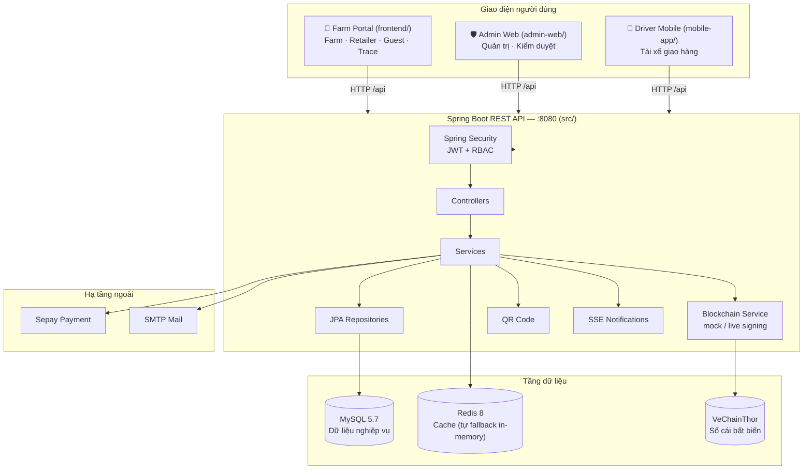

<div align="center">

# 🌾 BICAP — Blockchain Agricultural Platform

**Tích hợp Blockchain trong sản xuất nông sản sạch**

Nền tảng truy xuất nguồn gốc nông sản **"từ nông trại đến bàn ăn"** (farm-to-table) — ghi nhận toàn bộ vòng đời sản phẩm (mùa vụ → quy trình canh tác → thu hoạch → xuất bán → vận chuyển) thành các chứng thực *(attestation)* bất biến trên blockchain **VeChainThor**, kết nối **nông trại – nhà bán lẻ – người tiêu dùng** qua sàn giao dịch và truy xuất bằng mã QR.

[](https://github.com/ngnsusinn/bicap-blockchain-agricultural-platform)
[]()
[]()
[]()
[]()
[]()
[]()
[]()
[]()
[]()
[]()
[]()

</div>

---

## 📑 Mục lục

- [✨ Giới thiệu](#giới-thiệu)
- [🎯 Tính năng chính](#tính-năng-chính)
- [🏗️ Kiến trúc hệ thống](#kiến-trúc-hệ-thống)
- [🧰 Công nghệ sử dụng](#công-nghệ-sử-dụng)
- [📁 Cấu trúc repository](#cấu-trúc-repository)
- [🚀 Bắt đầu nhanh](#bắt-đầu-nhanh)
  - [Yêu cầu môi trường](#yêu-cầu-môi-trường)
  - [Cài đặt & chạy backend](#cài-đặt--chạy-backend)
  - [Chạy frontend ở chế độ phát triển](#chạy-frontend-ở-chế-độ-phát-triển)
  - [Chế độ 1 cổng (demo/test)](#chế-độ-1-cổng-demotest)
  - [Chạy bằng Docker](#chạy-bằng-docker)
  - [Tài khoản demo](#tài-khoản-demo)
- [⚙️ Cấu hình & biến môi trường](#cấu-hình--biến-môi-trường)
- [⛓️ Tích hợp Blockchain (VeChainThor)](#tích-hợp-blockchain-vechainthor)
- [🧪 Kiểm thử & CI/CD](#kiểm-thử--cicd)
- [📚 Tài liệu dự án](#tài-liệu-dự-án)
- [🔭 Định hướng phát triển](#định-hướng-phát-triển)
- [🤝 Đóng góp](#đóng-góp)
- [👥 Đội ngũ phát triển](#đội-ngũ-phát-triển)
- [📄 Giấy phép](#giấy-phép)

---

## ✨ Giới thiệu

**BICAP** *(Blockchain Integration in Clean Agricultural Production)* ra đời nhằm giải quyết ba vấn đề thực tế của ngành nông sản sạch Việt Nam:

1. **Minh bạch nguồn gốc** — người tiêu dùng không biết rõ sản phẩm mình mua được sản xuất, canh tác và vận chuyển thế nào.
2. **Khó quản lý quy trình** — nông trại vừa và nhỏ thiếu công cụ giám sát quy trình sản xuất và đáp ứng tiêu chuẩn an toàn thực phẩm.
3. **Kết nối thị trường** — nông trại gặp khó khăn trong việc tiếp cận nhà bán lẻ và người mua.

Hệ thống dùng blockchain làm **sổ cái bất biến** lưu chứng thực mùa vụ, quy trình canh tác, lô hàng xuất bán và mã QR truy xuất — hình ảnh/dữ liệu lớn được lưu ngoài chuỗi (off-chain) và chỉ **hash** được ghi lên chuỗi, giúp cân bằng giữa chi phí, tốc độ và tính toàn vẹn dữ liệu.

> 📌 Dự án là sản phẩm học thuật theo quy trình phát triển phần mềm bài bản (đặc tả yêu cầu → thiết kế kiến trúc C4 → thiết kế chi tiết → lập trình → kiểm thử → UAT).

---

## 🎯 Tính năng chính

### 👨‍🌾 Phân hệ Nông trại (Farm Manager)
| Tính năng | Mô tả |
|---|---|
| Quản lý nông trại | Đăng ký/đăng nhập, hồ sơ chủ sở hữu, giấy phép kinh doanh, chứng nhận & thông tin nông trại |
| Mùa vụ & quy trình | Tạo mùa vụ, ghi nhật ký quy trình canh tác (bón phân, phun thuốc, tưới tiêu, thu hoạch kèm vật tư & hình ảnh) — **được ghi lên blockchain** |
| Gói dịch vụ & thuê bao | Mua gói dịch vụ qua chuyển khoản, thanh toán tự kích hoạt qua webhook **Sepay** |
| Sàn giao dịch | Đẩy sản phẩm sau thu hoạch lên sàn, quản lý tin đăng, xử lý yêu cầu mua từ nhà bán lẻ |
| Truy xuất nguồn gốc | Xuất lô hàng kèm **mã QR** — mỗi lô xuất bán được chứng thực trên chuỗi |
| IoT & cảnh báo | Dashboard dữ liệu IoT (nhiệt độ, độ ẩm, pH), cảnh báo ngưỡng và báo cáo cuối ngày |
| Báo cáo | Gửi báo cáo/sự cố/khiếu nại lên Admin, theo dõi vận chuyển |

### 🏪 Phân hệ Nhà bán lẻ (Retailer)
| Tính năng | Mô tả |
|---|---|
| Onboarding & KYC | Đăng ký có **xác thực email**, hồ sơ kinh doanh, giấy phép (cửa hàng/siêu thị/bán buôn...) |
| Mua hàng | Tìm kiếm & lọc nông sản trên sàn, đặt yêu cầu mua, **đặt cọc 30%** trong 24h sau khi nông trại chấp nhận (quá hạn tự hủy) |
| Truy xuất | Quét **mã QR** trên lô hàng để xem toàn bộ quy trình mùa vụ |
| Vận chuyển & nhận hàng | Theo dõi vận đơn, xác nhận đã nhận đủ hàng + tải ảnh chứng từ |

### 🚚 Phân hệ Vận chuyển (Shipping Manager & Driver)
| Tính năng | Mô tả |
|---|---|
| Quản lý vận đơn | Tạo/hủy vận đơn từ đơn hàng đã đặt cọc, theo dõi trạng thái `CREATED → PENDING_PICKUP → PICKED_UP → IN_TRANSIT → DELIVERED` |
| Quản lý phương tiện & tài xế | CRUD xe và tài xế |
| Mobile tài xế | Ứng dụng web mobile: danh sách vận đơn, **quét QR** khi nhận hàng tại nông trại, xác nhận nhận/giao hàng, cập nhật trạng thái, gửi báo cáo sự cố |

### 🛡️ Phân hệ Quản trị (Admin)
| Tính năng | Mô tả |
|---|---|
| Quản trị tài khoản | Tạo/sửa/xóa tài khoản admin với vai trò & quyền hạn chi tiết (SUPER_ADMIN / ADMIN / MODERATOR) |
| Duyệt nông trại | Xem/xét duyệt hoặc từ chối (bắt buộc nêu lý do) nông trại mới đăng ký |
| Giám sát sản phẩm | Quản lý danh mục, giám sát & kiểm duyệt sản phẩm trên sàn |
| Smart Contract | Theo dõi/kiểm soát hợp đồng thông minh & giao dịch blockchain |
| Dashboard & báo cáo | Thống kê, xử lý báo cáo/sự cố từ mọi vai trò |

### 👤 Khách (Guest)
- Xem & tìm kiếm sản phẩm công khai, lọc theo nguồn gốc/loại/chứng nhận.
- Xem nội dung giáo dục (bài viết, video) về nông nghiệp bền vững & an toàn thực phẩm.
- **Truy xuất công khai** trang `/trace/{hash}` từ mã QR trên sản phẩm.
- Nhận thông báo chung của nền tảng.

### 🔐 Bảo mật xuyên suốt
- Xác thực **JWT** (stateless) + phân quyền **RBAC** (`@PreAuthorize`, Users ↔ Roles ↔ Permissions nhiều-nhiều).
- Băm mật khẩu bằng **bcrypt**; khóa tài khoản **30 phút sau 5 lần đăng nhập sai**.
- **Rate limiting** `/api/auth/**` 30 req/phút/IP (HTTP 429).
- Token phân loại: access (24h, riêng Retailer 15 phút), refresh (7 ngày, xoay vòng), token xác thực email (24h).
- Fail-fast khi thiếu `JWT_SECRET`/`SEPAY_API_KEY`; giao dịch blockchain & webhook Sepay **idempotent** (chống trùng lặp).

---

## 🏗️ Kiến trúc hệ thống

Monorepo gồm **backend API đơn khối (monolith)** + **3 giao diện web** + **hợp đồng thông minh**, thiết kế theo mô hình Client–Server 3 tầng:



**Các tầng backend** (base package `vn.courses.ut.edu.javaprogramming.bicap`) — package-by-feature, tuân thủ chuẩn **Controller → Service → Repository**:

| Tầng | Mô tả |
|---|---|
| `controller/` | REST API, giao tiếp qua DTO |
| `service/` | Nghiệp vụ: auth, farm, retailer, mùa vụ, đơn hàng, vận chuyển, blockchain, thanh toán, thông báo, IoT, báo cáo... |
| `entity/` + `repository/` | Ánh xạ & truy cập dữ liệu (JPA) |
| `common/security/` | Lõi bảo mật: JWT filter, `ActorAuthorizer`, rate limit, khóa đăng nhập |
| `common/blockchain/` | Lõi VeChainThor: RLP encoder, ký secp256k1, client gọi node |
| `config/` | Security, CORS, cache Redis, seeder dữ liệu demo |

---

## 🧰 Công nghệ sử dụng

### Backend
| Công nghệ | Phiên bản | Mục đích |
|---|---|---|
| Java | 21 | Ngôn ngữ lập trình |
| Spring Boot | 3.3.0 | Framework REST API |
| Spring Security + JWT (jjwt) | — | Xác thực & phân quyền (RBAC) |
| Spring Data JPA / Hibernate | — | ORM, quản lý thực thể |
| Spring Cache + Redis | 8 | Cache tầng đọc (tự fallback in-memory) |
| MySQL / H2 | 5.7 / embedded | Cơ sở dữ liệu production / dev-test |
| Bouncy Castle | 1.78 | Mã hóa & ký giao dịch VeChainThor (secp256k1, blake2b, keccak) |
| ZXing | 3.5.3 | Sinh mã QR |
| Spring Mail + Actuator | — | Gửi email xác thực; health check `/actuator/health` |

### Frontend & Mobile
| Ứng dụng | Công nghệ | Cổng dev |
|---|---|---|
| `frontend/` — Farm Portal (Farm · Retailer · Guest) | React 19 + TypeScript + Vite + Vitest | `5174` |
| `admin-web/` — Admin Web | React 19 + TypeScript + Vite + Vitest + oxlint | `5173` |
| `mobile-app/` — Driver Mobile | React 18 + TypeScript + Vite, quét QR bằng `html5-qrcode`/`jsqr` | `5175` |

### Blockchain & Hạ tầng
- **VeChainThor** — nền tảng blockchain (PoA, token kép VET + VTHO; VTHO dùng trả gas).
- **Solidity 0.8.24 + OpenZeppelin Upgradeable** — hợp đồng thông minh (UUPS, AccessControl, Pausable).
- **Docker / docker-compose** — đóng gói & chạy hạ tầng; **GitHub Actions** — CI/CD.
- **k6** — kiểm thử tải (có sẵn runner không phụ thuộc bằng Node).

---

## 📁 Cấu trúc repository

```text
bicap-blockchain-agricultural-platform/
├── src/                          # 🔙 Backend Spring Boot (Java 21, Maven)
│   ├── main/java/vn/courses/ut/edu/javaprogramming/bicap/
│   │   ├── controller/ service/ repository/ entity/ dto/ ...
│   │   ├── common/security/      #   JWT, RBAC, rate-limit, khóa tài khoản
│   │   ├── common/blockchain/    #   RLP, ký secp256k1, client VeChainThor
│   │   └── config/               #   Security, Redis cache, seeder...
│   ├── main/resources/           #   application.properties, static/ (web đã build)
│   └── test/                     #   Unit & integration tests (JUnit 5, MockMvc)
├── frontend/                     # 🌾 Farm Portal — React 19 + Vite (port 5174)
├── admin-web/                    # 🛡️ Admin Web — React 19 + Vite (base /admin/)
├── mobile-app/                   # 🚚 Driver Mobile — React + Vite (port 5175)
├── blockchain/
│   └── contracts/Traceability.sol# ⛓️ 4 hợp đồng thông minh VeChainThor (UUPS upgradeable)
├── docs/                         # 📚 Tài liệu dự án (đặc tả, thiết kế, kiểm thử, UAT...)
│   └── sql/                      #   Script SQL từng sprint
├── loadtest/                     # 📊 Kịch bản kiểm thử tải (k6 + Node runner)
├── tools/                        # 🔧 Tiện ích blockchain Java (sinh ví, dò tx...)
├── .github/workflows/ci.yml      # 🤖 CI/CD: lint → build → test → Docker Hub
├── docker-compose.db.yml         # 🐳 api :8080, admin-web :3001, farm-portal :3002
├── Dockerfile                    # 🐳 Image backend (eclipse-temurin:21-jre)
├── pom.xml                       # 📦 Build Maven
├── .env.example                  # 🔑 Mẫu biến môi trường
├── build-web.bat                 # 🪟 Build 2 SPA → nhúng vào Spring Boot (1 cổng)
├── run-backend.bat               # 🪟 Chạy backend nhanh (Windows)
└── run-frontend.bat              # 🪟 Chạy Farm Portal dev (Windows)
```

---

## 🚀 Bắt đầu nhanh

### Yêu cầu môi trường

| Công cụ | Phiên bản | Ghi chú |
|---|---|---|
| JDK | 21 | Bắt buộc (CI dùng Corretto 21) |
| Maven | 3.9+ | Build backend |
| Node.js + npm | 20+ | Build 3 ứng dụng web |
| Docker | bất kỳ | Tùy chọn — chạy hạ tầng/compose |
| MySQL + Redis | 5.7 / 8 | Tùy chọn — backend **tự fallback** H2 in-memory & cache in-memory khi không cấu hình |

> ✅ **Chạy được ngay mà không cần MySQL/Redis:** backend mặc định dùng H2 in-memory (chế độ MySQL), blockchain ở chế độ `mock`, cache fallback in-memory — chỉ cần JDK 21 + Maven là khởi động được.

### Cài đặt & chạy backend

```bash
# 1. Clone repository
git clone https://github.com/ngnsusinn/bicap-blockchain-agricultural-platform.git
cd bicap-blockchain-agricultural-platform

# 2. (Tùy chọn) Tạo file .env từ mẫu — đủ biến cho môi trường production/cloud
cp .env.example .env
#    ⚠️ Sinh JWT_SECRET an toàn:  openssl rand -base64 48

# 3. Chạy backend (mặc định http://localhost:8080)
mvn spring-boot:run
```

Windows: chạy trực tiếp `run-backend.bat` (tự nạp `.env`, cài `node_modules`, chạy `mvn spring-boot:run`). Hoặc mở `src/main/java/.../Application.java` trong IntelliJ và Run.

Kiểm tra nhanh:

```bash
curl http://localhost:8080/actuator/health    # {"status":"UP"}
```

### Chạy frontend ở chế độ phát triển

Mỗi ứng dụng chạy độc lập với Vite dev server (hot-reload):

```bash
# 🌾 Farm Portal (Farm · Retailer · Guest) — http://localhost:5174
cd frontend && npm install && npm run dev

# 🛡️ Admin Web — http://localhost:5173/admin/
cd admin-web && npm install && npm run dev

# 🚚 Driver Mobile — http://localhost:5175
cd mobile-app && npm install && npm run dev
```

Trên Windows, `run-frontend.bat` chạy sẵn Farm Portal. Nhớ đặt `VITE_API_BASE_URL` trỏ về backend (mặc định `http://localhost:8080/api/admins`, backend tự suy origin từ giá trị này).

### Chế độ 1 cổng (demo/test)

Spring Boot có thể **phục vụ luôn cả 2 SPA đã build** trên cùng cổng `8080` — rất tiện để demo:

```bash
# 🪟 Windows: build 2 SPA và nhúng vào src/main/resources/static/
build-web.bat

# Sau đó chạy backend:
run-backend.bat    # hoặc: mvn spring-boot:run
```

| URL | Nội dung |
|---|---|
| http://localhost:8080/ | 🌾 Farm Portal (đăng nhập Farm/Retailer/Admin) |
| http://localhost:8080/admin/ | 🛡️ Admin Web |
| http://localhost:8080/api/** | REST API |
| http://localhost:8080/actuator/health | Health check |
| http://localhost:8080/trace/{hash} | 🔍 Trang truy xuất nguồn gốc công khai |

### Chạy bằng Docker

```bash
# Build JAR trước
mvn clean package -DskipTests

# Chạy toàn bộ hạ tầng
docker-compose -f docker-compose.db.yml up -d --build
```

| Service | Cổng | Ghi chú |
|---|---|---|
| `api` | 8080 | Backend Spring Boot (healthcheck `/actuator/health`) |
| `admin-web` | 3001 | Admin Web (nginx) |
| `farm-portal` | 3002 | Farm Portal (nginx) |
| `mysql` / `redis` | (tắt mặc định) | Bỏ comment trong compose nếu muốn chạy local; mặc định dùng cloud qua `.env` |

Build image thủ công: `docker build -t bicap-api .` (backend, image `eclipse-temurin:21-jre`, chạy user không đặc quyền `bicap`).

### Tài khoản demo

Backend tự seed dữ liệu demo khi khởi động (trang đăng nhập có nút điền nhanh):

| Vai trò | Email | Mật khẩu |
|---|---|---|
| Super Admin | `superadmin@bicap.com` | `Superadmin@2026` |
| Admin | `admin@bicap.com` | `Adminpassword@2026` |
| Moderator | `moderator@bicap.com` | `Moderator@2026` |
| Farm Manager | `farm@bicap.com` | `Farmpassword@2026` |
| Retailer | `retailer@bicap.com` | `Retailpassword@2026` |
| Shipping Manager | `shipping_mgr@bicap.com` | `Shipping@2026` |
| Ship Driver | `driver@bicap.com` | `Driver@2026` |

> 🔑 Chỉ dùng cho môi trường dev/demo — **bắt buộc đổi** khi triển khai thật.

---

## ⚙️ Cấu hình & biến môi trường

Sao chép `.env.example` → `.env`. Tên biến **phải khớp** `application.properties` (tiền tố `SPRING_*`, không phải `DB_*`). Bảng các biến quan trọng:

| Biến | Bắt buộc* | Mặc định | Mô tả |
|---|---|---|---|
| `JWT_SECRET` | ✅ Prod | — | Secret ký JWT (base64 ≥ 32 bytes). Fail-fast nếu thiếu |
| `SEPAY_API_KEY` | ✅ Prod | — | Khóa API cổng thanh toán Sepay. Fail-fast nếu thiếu |
| `SPRING_DATASOURCE_URL` / `_USERNAME` / `_PASSWORD` | Prod | H2 in-memory | Kết nối MySQL cloud/local |
| `DDL_AUTO` | — | `update` | `validate` cho production (quản lý schema bằng migration); `update` cho demo/test |
| `SERVER_PORT` | — | `8080` | Cổng backend |
| `JWT_EXPIRATION_MS`, `RETAILER_ACCESS_EXPIRATION_MS`, `REFRESH_TOKEN_EXPIRATION_MS`, `VERIFICATION_TOKEN_EXPIRATION_MS` | — | 24h / 15p / 7 ngày / 24h | Thời hạn từng loại token |
| `SMTP_HOST` / `_PORT` / `_USERNAME` / `_PASSWORD` | — | localhost / 587 | Gửi email xác thực Retailer |
| `FRONTEND_URL` | — | `http://localhost:5174` | URL frontend dùng trong email |
| `UPLOAD_DIR` | — | `uploads` | Thư mục lưu file upload (phục vụ tại `/uploads/**`) |
| `SEPAY_ACCOUNT_NO` / `SEPAY_BANK_NAME` | — | `123456789` / MBBank | Số tài khoản nhận tiền cọc/thanh toán |
| `SPRING_REDIS_HOST` / `_PORT` / `_PASSWORD` / `_SSL` | — | localhost | Redis cache — tự fallback in-memory nếu không kết nối được |
| `APP_CACHE_ENABLED` / `APP_CACHE_TTL_SECONDS` | — | `true` / `60` | Bật cache & thời gian sống |
| `BLOCKCHAIN_MODE` | — | `mock` | `mock` = hash mô phỏng (dev/CI); `live` = ký & broadcast giao dịch thật |
| `BLOCKCHAIN_NODE_URL` / `BLOCKCHAIN_PRIVATE_KEY` | Live | testnet | Node VeChainThor & ví ký (cần VTHO trả gas) |
| `BLOCKCHAIN_GAS_*`, `BLOCKCHAIN_EXPIRATION`, `BLOCKCHAIN_CONFIRM_INTERVAL_MS`, `BLOCKCHAIN_RETRY_INTERVAL_MS` | — | — | Gas, thời hạn & chu kỳ xác nhận/retry giao dịch |
| `VITE_API_BASE_URL` | — | `http://localhost:8080/api/admins` | Endpoint API cho frontend |
| `VITE_ADMIN_PORTAL_URL` | — | `/admin/` | Liên kết "Mở Admin" trên trang đăng nhập |

\* *Prod = bắt buộc khi triển khai production; dev/test có giá trị fallback sẵn trong code.*

---

## ⛓️ Tích hợp Blockchain (VeChainThor)

**Vai trò:** VeChainThor được chọn (ADR-005) làm sổ cái chứng thực cho truy xuất chuỗi cung ứng — ghi bất biến dữ liệu **mùa vụ, quy trình canh tác, lô xuất bán và metadata QR**; hình ảnh & dữ liệu IoT lưu off-chain, chỉ hash lên chuỗi.

**Hợp đồng thông minh** — `blockchain/contracts/Traceability.sol` (Solidity ^0.8.24, OpenZeppelin **UUPS upgradeable** + AccessControl/Pausable/ReentrancyGuard):

| Hợp đồng | Chức năng |
|---|---|
| `FarmingSeasonContract` | Quản lý mùa vụ: ID, loại, diện tích, ngày bắt đầu, trạng thái |
| `FarmingProcessContract` | Nhật ký quy trình canh tác từng mùa vụ |
| `ExportContract` | Chứng thực lô hàng xuất bán |
| `TraceabilityContract` | Truy vấn tổng hợp phục vụ truy xuất nguồn gốc theo QR/hash |

**Hai chế độ vận hành** (biến `BLOCKCHAIN_MODE`):

| Chế độ | Mô tả |
|---|---|
| `mock` *(mặc định)* | Hash mô phỏng, xác nhận tức thì — dùng cho dev/CI, không cần mạng |
| `live` | Ký giao dịch thật: RLP-encode → ký **secp256k1** (deterministic RFC 6979, low-s) → broadcast qua REST node VeChainThor → xác nhận receipt. Yêu cầu `BLOCKCHAIN_PRIVATE_KEY` (ví phải có **VTHO** trả gas) |

**Tự phục hồi giao dịch:** job nền `BlockchainMaintenanceJob` xác nhận receipt mỗi **15s**, tự retry giao dịch lỗi mỗi **60s** (tối đa 3 lần), hết hạn giao dịch kẹt > 30 phút. Mỗi giao dịch có khóa idempotency; `txHash` được lưu vào MySQL (`blockchain_transactions`) và có thể truy xuất công khai tại `/trace/{hash}`.

**Tiện ích** — thư mục `tools/` chứa các class Java hỗ trợ vận hành: `WalletGen` (sinh ví), `MnemonicToKey`, `AddrFromKey`, `TxProbe` (dò giao dịch trên node).

---

## 🧪 Kiểm thử & CI/CD

### Kiểm thử

| Loại | Công cụ | Lệnh | Phạm vi |
|---|---|---|---|
| Backend unit + integration | JUnit 5, Mockito, MockMvc | `mvn test` | **248 test case trong 35 tệp test** — auth/RBAC, duyệt nông trại, đơn hàng, thông báo, mã hóa blockchain (vector RLP, chữ ký RFC 6979), Sepay/thuê bao... kèm luồng tích hợp đầy đủ 12 bước (đăng ký → duyệt → thuê bao → mùa vụ → xuất bán → sàn → đơn hàng → cọc → vận chuyển → giao → xác nhận → báo cáo) |
| Frontend | Vitest + Testing Library + jsdom | `cd frontend && npm test` · `cd admin-web && npm test` | Component/helper: auth, login form, dashboard, StatusBadge, API helpers... |
| Tải & hiệu năng | k6 (hoặc runner Node) | `k6 run loadtest/k6-loadtest.js` hoặc `node loadtest/node-loadtest.mjs --base http://localhost:8080 --vus 20 --requests 200` | Nhiều kịch bản đọc (catalog, sàn giao dịch, chi tiết sản phẩm); tiêu chí p95 < 800ms, lỗi < 1% |
| Nghiệm thu (UAT) | — | xem [`docs/uat-plan.md`](docs/uat-plan.md) | 29 kịch bản theo vai trò (Farm 8, Retailer 6, Admin 7, Guest 3, Ops/NFR 5) |

### CI/CD — GitHub Actions

Workflow `.github/workflows/ci.yml` chạy trên push `main`/`feature/*` và PR vào `main` (có `concurrency` hủy job cũ):

1. **Admin Web CI** — Node 20, `npm ci`, oxlint, build.
2. **Farm Portal CI** — Node 20, `npm ci`, build.
3. **Backend CI** — JDK 21 (Corretto), `mvn clean test` + `mvn package`, upload artifact JAR.
4. **Docker Build & Push** — cần 2 job trên thành công; Buildx + QEMU, đẩy image backend (`bicap-blockchain-agricultural-platform`) và admin-web (`bicap-admin-web`) lên Docker Hub (chỉ khi push thật, không phải PR).

---

## 📚 Tài liệu dự án

Toàn bộ hồ sơ kỹ thuật theo quy trình phát triển phần mềm nằm trong [`docs/`](docs/):

| Tài liệu | Nội dung |
|---|---|
| [`docs/requirement.md`](docs/requirement.md) | Đề xuất đề tài: bối cảnh, giải pháp, phân tích yêu cầu theo vai trò |
| [`docs/user-requirements.md`](docs/user-requirements.md) | Đặc tả yêu cầu người dùng |
| [`docs/software-requirement-specifications.md`](docs/software-requirement-specifications.md) | SRS — đặc tả yêu cầu phần mềm chi tiết |
| [`docs/architecture-design.md`](docs/architecture-design.md) | Thiết kế kiến trúc (C4), lựa chọn công nghệ, ADR |
| [`docs/detail-design.md`](docs/detail-design.md) | Thiết kế chi tiết từng module (BICAP-xx) |
| [`docs/module-core-security.md`](docs/module-core-security.md) | Thiết kế lõi bảo mật & RBAC (BICAP-72) |
| [`docs/system-implementation.md`](docs/system-implementation.md) | Tài liệu triển khai hệ thống |
| [`docs/testing-document.md`](docs/testing-document.md) | Tài liệu kiểm thử |
| [`docs/uat-plan.md`](docs/uat-plan.md) | Kế hoạch nghiệm thu UAT |
| [`docs/installation-guide.md`](docs/installation-guide.md) · [`docs/run-guide.md`](docs/run-guide.md) | Hướng dẫn cài đặt & chạy |
| [`docs/user-manual.md`](docs/user-manual.md) | Hướng dẫn sử dụng từng phân hệ |
| [`docs/BAO-CAO-TONG-HOP.md`](docs/BAO-CAO-TONG-HOP.md) | Báo cáo tổng hợp tiến độ dự án |
| [`docs/sql/`](docs/sql/) | Script SQL từng sprint (schema, dữ liệu mẫu) |

---

## 🔭 Định hướng phát triển

- **Vận hành live blockchain:** deploy 4 smart contract lên VeChainThor testnet/mainnet và bật `BLOCKCHAIN_MODE=live` (hiện mặc định `mock`).
- **Tách phân hệ độc lập:** theo đặc tả ban đầu, tách Retailer & Shipping Manager thành web app riêng (hiện gộp trong Farm Portal/Admin Web).
- **Mobile native:** đóng gói ứng dụng tài xế thành mobile app native (hiện là ứng dụng web tối ưu mobile).
- **Gia cố bảo mật:** lưu token trong httpOnly cookie (NFR-011), audit log, HTTPS/TLS cho production.

---

## 🤝 Đóng góp

1. Fork repository và tạo nhánh theo quy ước: `BICAP-<số>-<mô tả ngắn>` (hoặc `feature/bicap-<số>-...`) — tham khảo các nhánh hiện có.
2. Commit theo chuẩn conventional (`feat:`, `fix:`, `docs:`, `test:`...) kèm mã yêu cầu BICAP-xx.
3. Bổ sung/cập nhật tài liệu tương ứng trong `docs/` và đảm bảo test xanh (`mvn test`, `npm test`).
4. Mở Pull Request vào nhánh `main` — CI tự chạy lint/build/test.

> Quy ước dự án: mỗi tính năng gắn mã **BICAP-<n>**, hồ sơ thiết kế theo từng mã tại `docs/detail-design.md`.

---
<div align="center">
  <sub>🌾 <b>BICAP</b> — Tích hợp Blockchain trong sản xuất nông sản sạch </sub>
</div>
<div align="center">

# 🌾 BICAP — Blockchain Agricultural Platform

**Tích hợp Blockchain trong sản xuất nông sản sạch**

Nền tảng truy xuất nguồn gốc nông sản **"từ nông trại đến bàn ăn"** (farm-to-table) — ghi nhận toàn bộ vòng đời sản phẩm (mùa vụ → quy trình canh tác → thu hoạch → xuất bán → vận chuyển) thành các chứng thực *(attestation)* bất biến trên blockchain **VeChainThor**, kết nối **nông trại – nhà bán lẻ – người tiêu dùng** qua sàn giao dịch và truy xuất bằng mã QR.

[](https://github.com/ngnsusinn/bicap-blockchain-agricultural-platform)
[]()
[]()
[]()
[]()
[]()
[]()
[]()
[]()
[]()
[]()
[]()

</div>

---

## 📑 Mục lục

- [✨ Giới thiệu](#giới-thiệu)
- [🎯 Tính năng chính](#tính-năng-chính)
- [🏗️ Kiến trúc hệ thống](#kiến-trúc-hệ-thống)
- [🧰 Công nghệ sử dụng](#công-nghệ-sử-dụng)
- [📁 Cấu trúc repository](#cấu-trúc-repository)
- [🚀 Bắt đầu nhanh](#bắt-đầu-nhanh)
  - [Yêu cầu môi trường](#yêu-cầu-môi-trường)
  - [Cài đặt & chạy backend](#cài-đặt--chạy-backend)
  - [Chạy frontend ở chế độ phát triển](#chạy-frontend-ở-chế-độ-phát-triển)
  - [Chế độ 1 cổng (demo/test)](#chế-độ-1-cổng-demotest)
  - [Chạy bằng Docker](#chạy-bằng-docker)
  - [Tài khoản demo](#tài-khoản-demo)
- [⚙️ Cấu hình & biến môi trường](#cấu-hình--biến-môi-trường)
- [⛓️ Tích hợp Blockchain (VeChainThor)](#tích-hợp-blockchain-vechainthor)
- [🧪 Kiểm thử & CI/CD](#kiểm-thử--cicd)
- [📚 Tài liệu dự án](#tài-liệu-dự-án)
- [🔭 Định hướng phát triển](#định-hướng-phát-triển)
- [🤝 Đóng góp](#đóng-góp)
- [👥 Đội ngũ phát triển](#đội-ngũ-phát-triển)
- [📄 Giấy phép](#giấy-phép)

---

## ✨ Giới thiệu

**BICAP** *(Blockchain Integration in Clean Agricultural Production)* ra đời nhằm giải quyết ba vấn đề thực tế của ngành nông sản sạch Việt Nam:

1. **Minh bạch nguồn gốc** — người tiêu dùng không biết rõ sản phẩm mình mua được sản xuất, canh tác và vận chuyển thế nào.
2. **Khó quản lý quy trình** — nông trại vừa và nhỏ thiếu công cụ giám sát quy trình sản xuất và đáp ứng tiêu chuẩn an toàn thực phẩm.
3. **Kết nối thị trường** — nông trại gặp khó khăn trong việc tiếp cận nhà bán lẻ và người mua.

Hệ thống dùng blockchain làm **sổ cái bất biến** lưu chứng thực mùa vụ, quy trình canh tác, lô hàng xuất bán và mã QR truy xuất — hình ảnh/dữ liệu lớn được lưu ngoài chuỗi (off-chain) và chỉ **hash** được ghi lên chuỗi, giúp cân bằng giữa chi phí, tốc độ và tính toàn vẹn dữ liệu.

> 📌 Dự án là sản phẩm học thuật theo quy trình phát triển phần mềm bài bản (đặc tả yêu cầu → thiết kế kiến trúc C4 → thiết kế chi tiết → lập trình → kiểm thử → UAT), toàn bộ hồ sơ nằm trong thư mục [`docs/`](docs/).

---

## 🎯 Tính năng chính

### 👨‍🌾 Phân hệ Nông trại (Farm Manager)
| Tính năng | Mô tả |
|---|---|
| Quản lý nông trại | Đăng ký/đăng nhập, hồ sơ chủ sở hữu, giấy phép kinh doanh, chứng nhận & thông tin nông trại |
| Mùa vụ & quy trình | Tạo mùa vụ, ghi nhật ký quy trình canh tác (bón phân, phun thuốc, tưới tiêu, thu hoạch kèm vật tư & hình ảnh) — **được ghi lên blockchain** |
| Gói dịch vụ & thuê bao | Mua gói dịch vụ qua chuyển khoản, thanh toán tự kích hoạt qua webhook **Sepay** |
| Sàn giao dịch | Đẩy sản phẩm sau thu hoạch lên sàn, quản lý tin đăng, xử lý yêu cầu mua từ nhà bán lẻ |
| Truy xuất nguồn gốc | Xuất lô hàng kèm **mã QR** — mỗi lô xuất bán được chứng thực trên chuỗi |
| IoT & cảnh báo | Dashboard dữ liệu IoT (nhiệt độ, độ ẩm, pH), cảnh báo ngưỡng và báo cáo cuối ngày |
| Báo cáo | Gửi báo cáo/sự cố/khiếu nại lên Admin, theo dõi vận chuyển |

### 🏪 Phân hệ Nhà bán lẻ (Retailer)
| Tính năng | Mô tả |
|---|---|
| Onboarding & KYC | Đăng ký có **xác thực email**, hồ sơ kinh doanh, giấy phép (cửa hàng/siêu thị/bán buôn...) |
| Mua hàng | Tìm kiếm & lọc nông sản trên sàn, đặt yêu cầu mua, **đặt cọc 30%** trong 24h sau khi nông trại chấp nhận (quá hạn tự hủy) |
| Truy xuất | Quét **mã QR** trên lô hàng để xem toàn bộ quy trình mùa vụ |
| Vận chuyển & nhận hàng | Theo dõi vận đơn, xác nhận đã nhận đủ hàng + tải ảnh chứng từ |

### 🚚 Phân hệ Vận chuyển (Shipping Manager & Driver)
| Tính năng | Mô tả |
|---|---|
| Quản lý vận đơn | Tạo/hủy vận đơn từ đơn hàng đã đặt cọc, theo dõi trạng thái `CREATED → PENDING_PICKUP → PICKED_UP → IN_TRANSIT → DELIVERED` |
| Quản lý phương tiện & tài xế | CRUD xe và tài xế |
| Mobile tài xế | Ứng dụng web mobile: danh sách vận đơn, **quét QR** khi nhận hàng tại nông trại, xác nhận nhận/giao hàng, cập nhật trạng thái, gửi báo cáo sự cố |

### 🛡️ Phân hệ Quản trị (Admin)
| Tính năng | Mô tả |
|---|---|
| Quản trị tài khoản | Tạo/sửa/xóa tài khoản admin với vai trò & quyền hạn chi tiết (SUPER_ADMIN / ADMIN / MODERATOR) |
| Duyệt nông trại | Xem/xét duyệt hoặc từ chối (bắt buộc nêu lý do) nông trại mới đăng ký |
| Giám sát sản phẩm | Quản lý danh mục, giám sát & kiểm duyệt sản phẩm trên sàn |
| Smart Contract | Theo dõi/kiểm soát hợp đồng thông minh & giao dịch blockchain |
| Dashboard & báo cáo | Thống kê, xử lý báo cáo/sự cố từ mọi vai trò |

### 👤 Khách (Guest)
- Xem & tìm kiếm sản phẩm công khai, lọc theo nguồn gốc/loại/chứng nhận.
- Xem nội dung giáo dục (bài viết, video) về nông nghiệp bền vững & an toàn thực phẩm.
- **Truy xuất công khai** trang `/trace/{hash}` từ mã QR trên sản phẩm.
- Nhận thông báo chung của nền tảng.

### 🔐 Bảo mật xuyên suốt
- Xác thực **JWT** (stateless) + phân quyền **RBAC** (`@PreAuthorize`, Users ↔ Roles ↔ Permissions nhiều-nhiều).
- Băm mật khẩu bằng **bcrypt**; khóa tài khoản **30 phút sau 5 lần đăng nhập sai**.
- **Rate limiting** `/api/auth/**` 30 req/phút/IP (HTTP 429).
- Token phân loại: access (24h, riêng Retailer 15 phút), refresh (7 ngày, xoay vòng), token xác thực email (24h).
- Fail-fast khi thiếu `JWT_SECRET`/`SEPAY_API_KEY`; giao dịch blockchain & webhook Sepay **idempotent** (chống trùng lặp).

---

## 🏗️ Kiến trúc hệ thống

Monorepo gồm **backend API đơn khối (monolith)** + **3 giao diện web** + **hợp đồng thông minh**, thiết kế theo mô hình Client–Server 3 tầng:


**Các tầng backend** (base package `vn.courses.ut.edu.javaprogramming.bicap`) — package-by-feature, tuân thủ chuẩn **Controller → Service → Repository**:

| Tầng | Mô tả |
|---|---|
| `controller/` | REST API, giao tiếp qua DTO |
| `service/` | Nghiệp vụ: auth, farm, retailer, mùa vụ, đơn hàng, vận chuyển, blockchain, thanh toán, thông báo, IoT, báo cáo... |
| `entity/` + `repository/` | Ánh xạ & truy cập dữ liệu (JPA) |
| `common/security/` | Lõi bảo mật: JWT filter, `ActorAuthorizer`, rate limit, khóa đăng nhập |
| `common/blockchain/` | Lõi VeChainThor: RLP encoder, ký secp256k1, client gọi node |
| `config/` | Security, CORS, cache Redis, seeder dữ liệu demo |

> 💡 **Ghi chú triển khai:** trong chế độ chạy 1 cổng, Spring Boot phục vụ luôn cả 2 SPA đã build (Farm Portal tại `/`, Admin Web tại `/admin/`) qua thư mục `static/` — xem [Chế độ 1 cổng](#chế-độ-1-cổng-demotest).

---

## 🧰 Công nghệ sử dụng

### Backend
| Công nghệ | Phiên bản | Mục đích |
|---|---|---|
| Java | 21 | Ngôn ngữ lập trình |
| Spring Boot | 3.3.0 | Framework REST API |
| Spring Security + JWT (jjwt) | — | Xác thực & phân quyền (RBAC) |
| Spring Data JPA / Hibernate | — | ORM, quản lý thực thể |
| Spring Cache + Redis | 8 | Cache tầng đọc (tự fallback in-memory) |
| MySQL / H2 | 5.7 / embedded | Cơ sở dữ liệu production / dev-test |
| Bouncy Castle | 1.78 | Mã hóa & ký giao dịch VeChainThor (secp256k1, blake2b, keccak) |
| ZXing | 3.5.3 | Sinh mã QR |
| Spring Mail + Actuator | — | Gửi email xác thực; health check `/actuator/health` |

### Frontend & Mobile
| Ứng dụng | Công nghệ | Cổng dev |
|---|---|---|
| `frontend/` — Farm Portal (Farm · Retailer · Guest) | React 19 + TypeScript + Vite + Vitest | `5174` |
| `admin-web/` — Admin Web | React 19 + TypeScript + Vite + Vitest + oxlint | `5173` |
| `mobile-app/` — Driver Mobile | React 18 + TypeScript + Vite, quét QR bằng `html5-qrcode`/`jsqr` | `5175` |

### Blockchain & Hạ tầng
- **VeChainThor** — nền tảng blockchain (PoA, token kép VET + VTHO; VTHO dùng trả gas).
- **Solidity ^0.8.24 + OpenZeppelin Upgradeable** — hợp đồng thông minh (UUPS, AccessControl, Pausable).
- **Docker / docker-compose** — đóng gói & chạy hạ tầng; **GitHub Actions** — CI/CD.
- **k6** — kiểm thử tải (có sẵn runner không phụ thuộc bằng Node).

---

## 📁 Cấu trúc repository

```text
bicap-blockchain-agricultural-platform/
├── src/                          # 🔙 Backend Spring Boot (Java 21, Maven)
│   ├── main/java/vn/courses/ut/edu/javaprogramming/bicap/
│   │   ├── controller/ service/ repository/ entity/ dto/ ...
│   │   ├── common/security/      #   JWT, RBAC, rate-limit, khóa tài khoản
│   │   ├── common/blockchain/    #   RLP, ký secp256k1, client VeChainThor
│   │   └── config/               #   Security, Redis cache, seeder...
│   ├── main/resources/           #   application.properties, static/ (web đã build)
│   └── test/                     #   Unit & integration tests (JUnit 5, MockMvc)
├── frontend/                     # 🌾 Farm Portal — React 19 + Vite (port 5174)
├── admin-web/                    # 🛡️ Admin Web — React 19 + Vite (base /admin/)
├── mobile-app/                   # 🚚 Driver Mobile — React + Vite (port 5175)
├── blockchain/
│   └── contracts/Traceability.sol# ⛓️ 4 hợp đồng thông minh VeChainThor (UUPS upgradeable)
├── docs/                         # 📚 Tài liệu dự án (đặc tả, thiết kế, kiểm thử, UAT...)
│   └── sql/                      #   Script SQL từng sprint
├── loadtest/                     # 📊 Kịch bản kiểm thử tải (k6 + Node runner)
├── tools/                        # 🔧 Tiện ích blockchain Java (sinh ví, dò tx...)
├── .github/workflows/ci.yml      # 🤖 CI/CD: lint → build → test → Docker Hub
├── docker-compose.db.yml         # 🐳 api :8080, admin-web :3001, farm-portal :3002
├── Dockerfile                    # 🐳 Image backend (eclipse-temurin:21-jre)
├── pom.xml                       # 📦 Build Maven
├── .env.example                  # 🔑 Mẫu biến môi trường
├── build-web.bat                 # 🪟 Build 2 SPA → nhúng vào Spring Boot (1 cổng)
├── run-backend.bat               # 🪟 Chạy backend nhanh (Windows)
└── run-frontend.bat              # 🪟 Chạy Farm Portal dev (Windows)
```

---

## 🚀 Bắt đầu nhanh

### Yêu cầu môi trường

| Công cụ | Phiên bản | Ghi chú |
|---|---|---|
| JDK | 21 | Bắt buộc (CI dùng Corretto 21) |
| Maven | 3.9+ | Build backend |
| Node.js + npm | 20+ | Build 3 ứng dụng web |
| Docker | bất kỳ | Tùy chọn — chạy hạ tầng/compose |
| MySQL + Redis | 5.7 / 8 | Tùy chọn — backend **tự fallback** H2 in-memory & cache in-memory khi không cấu hình |

> ✅ **Chạy được ngay mà không cần MySQL/Redis:** backend mặc định dùng H2 in-memory (chế độ MySQL), blockchain ở chế độ `mock`, cache fallback in-memory — chỉ cần JDK 21 + Maven là khởi động được.

### Cài đặt & chạy backend

```bash
# 1. Clone repository
git clone https://github.com/ngnsusinn/bicap-blockchain-agricultural-platform.git
cd bicap-blockchain-agricultural-platform

# 2. (Tùy chọn) Tạo file .env từ mẫu — đủ biến cho môi trường production/cloud
cp .env.example .env
#    ⚠️ Sinh JWT_SECRET an toàn:  openssl rand -base64 48

# 3. Chạy backend (mặc định http://localhost:8080)
mvn spring-boot:run
```

Windows: chạy trực tiếp `run-backend.bat` (tự nạp `.env`, cài `node_modules`, chạy `mvn spring-boot:run`). Hoặc mở `src/main/java/.../Application.java` trong IntelliJ và Run.

Kiểm tra nhanh:

```bash
curl http://localhost:8080/actuator/health    # {"status":"UP"}
```

### Chạy frontend ở chế độ phát triển

Mỗi ứng dụng chạy độc lập với Vite dev server (hot-reload):

```bash
# 🌾 Farm Portal (Farm · Retailer · Guest) — http://localhost:5174
cd frontend && npm install && npm run dev

# 🛡️ Admin Web — http://localhost:5173/admin/
cd admin-web && npm install && npm run dev

# 🚚 Driver Mobile — http://localhost:5175
cd mobile-app && npm install && npm run dev
```

Trên Windows, `run-frontend.bat` chạy sẵn Farm Portal. Nhớ đặt `VITE_API_BASE_URL` trỏ về backend (mặc định `http://localhost:8080/api/admins`, backend tự suy origin từ giá trị này).

### Chế độ 1 cổng (demo/test)

Spring Boot có thể **phục vụ luôn cả 2 SPA đã build** trên cùng cổng `8080` — rất tiện để demo:

```bash
# 🪟 Windows: build 2 SPA và nhúng vào src/main/resources/static/
build-web.bat

# Sau đó chạy backend:
run-backend.bat    # hoặc: mvn spring-boot:run
```

| URL | Nội dung |
|---|---|
| http://localhost:8080/ | 🌾 Farm Portal (đăng nhập Farm/Retailer/Admin) |
| http://localhost:8080/admin/ | 🛡️ Admin Web |
| http://localhost:8080/api/** | REST API |
| http://localhost:8080/actuator/health | Health check |
| http://localhost:8080/trace/{hash} | 🔍 Trang truy xuất nguồn gốc công khai |

### Chạy bằng Docker

```bash
# Build JAR trước
mvn clean package -DskipTests

# Chạy toàn bộ hạ tầng
docker-compose -f docker-compose.db.yml up -d --build
```

| Service | Cổng | Ghi chú |
|---|---|---|
| `api` | 8080 | Backend Spring Boot (healthcheck `/actuator/health`) |
| `admin-web` | 3001 | Admin Web (nginx) |
| `farm-portal` | 3002 | Farm Portal (nginx) |
| `mysql` / `redis` | (tắt mặc định) | Bỏ comment trong compose nếu muốn chạy local; mặc định dùng cloud qua `.env` |

Build image thủ công: `docker build -t bicap-api .` (backend, image `eclipse-temurin:21-jre`, chạy user không đặc quyền `bicap`).

### Tài khoản demo

Backend tự seed dữ liệu demo khi khởi động (trang đăng nhập có nút điền nhanh):

| Vai trò | Email | Mật khẩu |
|---|---|---|
| Super Admin | `superadmin@bicap.com` | `Superadmin@2026` |
| Admin | `admin@bicap.com` | `Adminpassword@2026` |
| Moderator | `moderator@bicap.com` | `Moderator@2026` |
| Farm Manager | `farm@bicap.com` | `Farmpassword@2026` |
| Retailer | `retailer@bicap.com` | `Retailpassword@2026` |
| Shipping Manager | `shipping_mgr@bicap.com` | `Shipping@2026` |
| Ship Driver | `driver@bicap.com` | `Driver@2026` |

> 🔑 Chỉ dùng cho môi trường dev/demo — **bắt buộc đổi** khi triển khai thật.

---

## ⚙️ Cấu hình & biến môi trường

Sao chép `.env.example` → `.env`. Tên biến **phải khớp** `application.properties` (tiền tố `SPRING_*`, không phải `DB_*`). Bảng các biến quan trọng:

| Biến | Bắt buộc* | Mặc định | Mô tả |
|---|---|---|---|
| `JWT_SECRET` | ✅ Prod | — | Secret ký JWT (base64 ≥ 32 bytes). Fail-fast nếu thiếu |
| `SEPAY_API_KEY` | ✅ Prod | — | Khóa API cổng thanh toán Sepay. Fail-fast nếu thiếu |
| `SPRING_DATASOURCE_URL` / `_USERNAME` / `_PASSWORD` | Prod | H2 in-memory | Kết nối MySQL cloud/local |
| `DDL_AUTO` | — | `update` | `validate` cho production (quản lý schema bằng migration); `update` cho demo/test |
| `SERVER_PORT` | — | `8080` | Cổng backend |
| `JWT_EXPIRATION_MS`, `RETAILER_ACCESS_EXPIRATION_MS`, `REFRESH_TOKEN_EXPIRATION_MS`, `VERIFICATION_TOKEN_EXPIRATION_MS` | — | 24h / 15p / 7 ngày / 24h | Thời hạn từng loại token |
| `SMTP_HOST` / `_PORT` / `_USERNAME` / `_PASSWORD` | — | localhost / 587 | Gửi email xác thực Retailer |
| `FRONTEND_URL` | — | `http://localhost:5174` | URL frontend dùng trong email |
| `UPLOAD_DIR` | — | `uploads` | Thư mục lưu file upload (phục vụ tại `/uploads/**`) |
| `SEPAY_ACCOUNT_NO` / `SEPAY_BANK_NAME` | — | `123456789` / MBBank | Số tài khoản nhận tiền cọc/thanh toán |
| `SPRING_REDIS_HOST` / `_PORT` / `_PASSWORD` / `_SSL` | — | localhost | Redis cache — tự fallback in-memory nếu không kết nối được |
| `APP_CACHE_ENABLED` / `APP_CACHE_TTL_SECONDS` | — | `true` / `60` | Bật cache & thời gian sống |
| `BLOCKCHAIN_MODE` | — | `mock` | `mock` = hash mô phỏng (dev/CI); `live` = ký & broadcast giao dịch thật |
| `BLOCKCHAIN_NODE_URL` / `BLOCKCHAIN_PRIVATE_KEY` | Live | testnet | Node VeChainThor & ví ký (cần VTHO trả gas) |
| `BLOCKCHAIN_GAS_*`, `BLOCKCHAIN_EXPIRATION`, `BLOCKCHAIN_CONFIRM_INTERVAL_MS`, `BLOCKCHAIN_RETRY_INTERVAL_MS` | — | — | Gas, thời hạn & chu kỳ xác nhận/retry giao dịch |
| `VITE_API_BASE_URL` | — | `http://localhost:8080/api/admins` | Endpoint API cho frontend |
| `VITE_ADMIN_PORTAL_URL` | — | `/admin/` | Liên kết "Mở Admin" trên trang đăng nhập |

\* *Prod = bắt buộc khi triển khai production; dev/test có giá trị fallback sẵn trong code.*

---

## ⛓️ Tích hợp Blockchain (VeChainThor)

**Vai trò:** VeChainThor được chọn (ADR-005) làm sổ cái chứng thực cho truy xuất chuỗi cung ứng — ghi bất biến dữ liệu **mùa vụ, quy trình canh tác, lô xuất bán và metadata QR**; hình ảnh & dữ liệu IoT lưu off-chain, chỉ hash lên chuỗi.

**Hợp đồng thông minh** — `blockchain/contracts/Traceability.sol` (Solidity ^0.8.24, OpenZeppelin **UUPS upgradeable** + AccessControl/Pausable/ReentrancyGuard):

| Hợp đồng | Chức năng |
|---|---|
| `FarmingSeasonContract` | Quản lý mùa vụ: ID, loại, diện tích, ngày bắt đầu, trạng thái |
| `FarmingProcessContract` | Nhật ký quy trình canh tác từng mùa vụ |
| `ExportContract` | Chứng thực lô hàng xuất bán |
| `TraceabilityContract` | Truy vấn tổng hợp phục vụ truy xuất nguồn gốc theo QR/hash |

**Hai chế độ vận hành** (biến `BLOCKCHAIN_MODE`):

| Chế độ | Mô tả |
|---|---|
| `mock` *(mặc định)* | Hash mô phỏng, xác nhận tức thì — dùng cho dev/CI, không cần mạng |
| `live` | Ký giao dịch thật: RLP-encode → ký **secp256k1** (deterministic RFC 6979, low-s) → broadcast qua REST node VeChainThor → xác nhận receipt. Yêu cầu `BLOCKCHAIN_PRIVATE_KEY` (ví phải có **VTHO** trả gas) |

**Tự phục hồi giao dịch:** job nền `BlockchainMaintenanceJob` xác nhận receipt mỗi **15s**, tự retry giao dịch lỗi mỗi **60s** (tối đa 3 lần), hết hạn giao dịch kẹt > 30 phút. Mỗi giao dịch có khóa idempotency; `txHash` được lưu vào MySQL (`blockchain_transactions`) và có thể truy xuất công khai tại `/trace/{hash}`.

**Tiện ích** — thư mục `tools/` chứa các class Java hỗ trợ vận hành: `WalletGen` (sinh ví), `MnemonicToKey`, `AddrFromKey`, `TxProbe` (dò giao dịch trên node).

---

## 🧪 Kiểm thử & CI/CD

### Kiểm thử

| Loại | Công cụ | Lệnh | Phạm vi |
|---|---|---|---|
| Backend unit + integration | JUnit 5, Mockito, MockMvc | `mvn test` | **248 test case trong 35 tệp test** — auth/RBAC, duyệt nông trại, đơn hàng, thông báo, mã hóa blockchain (vector RLP, chữ ký RFC 6979), Sepay/thuê bao... kèm luồng tích hợp đầy đủ 12 bước (đăng ký → duyệt → thuê bao → mùa vụ → xuất bán → sàn → đơn hàng → cọc → vận chuyển → giao → xác nhận → báo cáo) |
| Frontend | Vitest + Testing Library + jsdom | `cd frontend && npm test` · `cd admin-web && npm test` | Component/helper: auth, login form, dashboard, StatusBadge, API helpers... |
| Tải & hiệu năng | k6 (hoặc runner Node) | `k6 run loadtest/k6-loadtest.js` hoặc `node loadtest/node-loadtest.mjs --base http://localhost:8080 --vus 20 --requests 200` | Nhiều kịch bản đọc (catalog, sàn giao dịch, chi tiết sản phẩm); tiêu chí p95 < 800ms, lỗi < 1% |
| Nghiệm thu (UAT) | — | xem [`docs/uat-plan.md`](docs/uat-plan.md) | 29 kịch bản theo vai trò (Farm 8, Retailer 6, Admin 7, Guest 3, Ops/NFR 5) |

### CI/CD — GitHub Actions

Workflow `.github/workflows/ci.yml` chạy trên push `main`/`feature/*` và PR vào `main` (có `concurrency` hủy job cũ):

1. **Admin Web CI** — Node 20, `npm ci`, oxlint, build.
2. **Farm Portal CI** — Node 20, `npm ci`, build.
3. **Backend CI** — JDK 21 (Corretto), `mvn clean test` + `mvn package`, upload artifact JAR.
4. **Docker Build & Push** — cần 2 job trên thành công; Buildx + QEMU, đẩy image backend (`bicap-blockchain-agricultural-platform`) và admin-web (`bicap-admin-web`) lên Docker Hub (chỉ khi push thật, không phải PR).

---

## 📚 Tài liệu dự án

Toàn bộ hồ sơ kỹ thuật theo quy trình phát triển phần mềm nằm trong [`docs/`](docs/):

| Tài liệu | Nội dung |
|---|---|
| [`docs/requirement.md`](docs/requirement.md) | Đề xuất đề tài: bối cảnh, giải pháp, phân tích yêu cầu theo vai trò |
| [`docs/user-requirements.md`](docs/user-requirements.md) | Đặc tả yêu cầu người dùng |
| [`docs/software-requirement-specifications.md`](docs/software-requirement-specifications.md) | SRS — đặc tả yêu cầu phần mềm chi tiết |
| [`docs/architecture-design.md`](docs/architecture-design.md) | Thiết kế kiến trúc (C4), lựa chọn công nghệ, ADR |
| [`docs/detail-design.md`](docs/detail-design.md) | Thiết kế chi tiết từng module (BICAP-xx) |
| [`docs/module-core-security.md`](docs/module-core-security.md) | Thiết kế lõi bảo mật & RBAC (BICAP-72) |
| [`docs/system-implementation.md`](docs/system-implementation.md) | Tài liệu triển khai hệ thống |
| [`docs/testing-document.md`](docs/testing-document.md) | Tài liệu kiểm thử |
| [`docs/uat-plan.md`](docs/uat-plan.md) | Kế hoạch nghiệm thu UAT |
| [`docs/installation-guide.md`](docs/installation-guide.md) · [`docs/run-guide.md`](docs/run-guide.md) | Hướng dẫn cài đặt & chạy |
| [`docs/user-manual.md`](docs/user-manual.md) | Hướng dẫn sử dụng từng phân hệ |
| [`docs/BAO-CAO-TONG-HOP.md`](docs/BAO-CAO-TONG-HOP.md) | Báo cáo tổng hợp tiến độ dự án |
| [`docs/sql/`](docs/sql/) | Script SQL từng sprint (schema, dữ liệu mẫu) |

---

## 🔭 Định hướng phát triển

- **Vận hành live blockchain:** deploy 4 smart contract lên VeChainThor testnet/mainnet và bật `BLOCKCHAIN_MODE=live` (hiện mặc định `mock`).
- **Tách phân hệ độc lập:** theo đặc tả ban đầu, tách Retailer & Shipping Manager thành web app riêng (hiện gộp trong Farm Portal/Admin Web).
- **Mobile native:** đóng gói ứng dụng tài xế thành mobile app native (hiện là ứng dụng web tối ưu mobile).
- **Gia cố bảo mật:** lưu token trong httpOnly cookie (NFR-011), audit log, HTTPS/TLS cho production.

---

## 🤝 Đóng góp

1. Fork repository và tạo nhánh theo quy ước: `BICAP-<số>-<mô tả ngắn>` (hoặc `feature/bicap-<số>-...`) — tham khảo các nhánh hiện có.
2. Commit theo chuẩn conventional (`feat:`, `fix:`, `docs:`, `test:`...) kèm mã yêu cầu BICAP-xx.
3. Bổ sung/cập nhật tài liệu tương ứng trong `docs/` và đảm bảo test xanh (`mvn test`, `npm test`).
4. Mở Pull Request vào nhánh `main` — CI tự chạy lint/build/test.

> Quy ước dự án: mỗi tính năng gắn mã **BICAP-<n>**, hồ sơ thiết kế theo từng mã tại `docs/detail-design.md`.

---

## 👥 Đội ngũ phát triển

Thống kê từ lịch sử commit (`git shortlog`):

| Thành viên | Số commit |
|---|---|
| Sin Nguyen Sun | 82 |
| Duy An | 15 |
| XuanAnh1312 | 14 |
| Minjju12 | 13 |
| Doan Phuong Thien An | 8 |
| Nguyễn Tuấn Anh | 2 |

---

## 📄 Giấy phép

Repository **chưa có file LICENSE** — mã nguồn hiện được cung cấp cho mục đích học thuật & demo. Vui lòng liên hệ đội ngũ phát triển trước khi sử dụng cho mục đích thương mại hoặc tái phân phối.

---

<div align="center">
  <sub>🌾 <b>BICAP</b> — Tích hợp Blockchain trong sản xuất nông sản sạch · Built with ❤️ by the BICAP team</sub>
</div>
